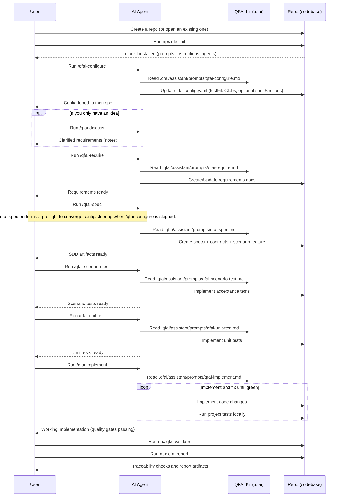

# QFAI (Quality-First AI)

QFAI is a quality-first development kit for AI coding agents.
Its purpose is to improve the quality of AI-generated software outputs by enforcing a structured workflow and validating traceability.

Modern AI coding agents can write code quickly, but they can also misunderstand requirements, drift from intended behavior, or “sound correct” while being wrong.
QFAI addresses these failure modes by standardizing an end-to-end delivery loop and forcing objective checks.

- SDD clarifies what to build, so the agent does not invent requirements while coding.
- ATDD defines acceptance goals as executable scenarios, so correctness is measured rather than assumed.
- TDD enables a self-correcting loop: implement → run tests → fix → repeat.
- Traceability validation enforces that SDD → ATDD → TDD → implementation stays aligned, reducing hallucination-driven drift.
- Result: higher output quality, fewer review cycles, and lower human supervision cost.

QFAI is designed for a prompt-driven operating model: engineers select a prepared custom prompt and provide only the task intent.
The agent reads the repository, produces the required artifacts, and iterates until the hard gates pass.

## Quick start

```bash
# 1) Initialize QFAI assets in your repository
npx qfai init

# 2) Validate traceability (use this in CI as a hard gate)
npx qfai validate

# 3) Generate a human-readable report (Markdown)
npx qfai report
```

## What you can do (CLI commands)

- `npx qfai init`
  - Creates the QFAI workspace under `.qfai/` (requirements/specs/contracts/report) and installs the AI assistant kit (`assistant/` with prompts, instructions, agents, and steering templates for product/tech/structure/manifest), plus a default GitHub Actions workflow and `qfai.config.yaml`.
- `npx qfai validate`
  - Validates specs/contracts/scenarios/traceability and writes `.qfai/report/validate.json`; use `--fail-on error` (or `--fail-on warning`) to turn it into a CI gate, and `--format github` to emit GitHub-friendly annotations.
- `npx qfai report`
  - Produces a human-readable report (`report.md` by default) or an internal JSON export (`report.json`) from `validate.json`; use `--base-url` to link file paths in Markdown to your repository viewer.
- `npx qfai doctor`
  - Diagnoses configuration discovery, path resolution, glob scanning, and `validate.json` inputs before running validate/report; use `--fail-on` to enforce failures in CI.
- `npx qfai guardrails`
  - Lists, extracts, or checks Decision Guardrails in `delta.md` (`list` / `extract` / `check`); use `--path` to point at samples or custom locations.

## Operating model (prompt-driven workflow)

QFAI assumes you operate the project primarily via prepared custom prompts.
A custom prompt is a reusable task instruction set for your AI coding agent (for example, an editor “slash command”, or an external prompt file that links to these QFAI prompt bodies).
The agent reads QFAI assets under `.qfai/assistant/` and produces or updates SDD/ATDD/TDD artifacts and code.

### Where the prompts live

- QFAI standard prompt bodies: `.qfai/assistant/prompts/**` (may be overwritten when you re-run `qfai init`).
- Your local overrides: `.qfai/assistant/prompts.local/**` (never overwritten by QFAI; prefer this for customizations).
- Rule: if the same relative path exists in both, treat `prompts.local/` as the higher-priority source.

### Minimal custom prompt set

QFAI includes a small set of custom prompts (stored under `.qfai/assistant/prompts/`) designed to keep the workflow opinionated and repeatable.

- **qfai-configure**: Analyze the repository (language, frameworks, test layout, directory structure) and update steering (`product.md`, `tech.md`, `structure.md`, `manifest.md`) plus `qfai.config.yaml` with a minimal diff (especially `testFileGlobs`, and optionally `validation.require.specSections` when you want strict headings). Run this once right after `npx qfai init`, and re-run it when the repository structure changes or when you want to enforce required spec headings. Output: updated steering + YAML + validation checklist.
- **qfai-discuss**: Turn an idea into clear requirements by discussing scope, constraints, risks, and open questions.
- **qfai-require**: Produce `.qfai/require/require.md` from your idea or discussion output.
- **qfai-spec**: Produce `.qfai/specs/*` and `.qfai/contracts/*` from the requirements, including traceability scaffolding.
  - Includes a preflight step that bootstraps missing `qfai.config.yaml` and `assistant/steering/*` when run directly after init.
- **qfai-scenario-test**: Implement acceptance tests (ATDD) driven by specs/scenarios.
- **qfai-unit-test**: Implement unit tests (TDD) driven by specs/scenarios.
- **qfai-implement**: Implement the feature; iterate test→fix until all quality gates are green.
- **qfai-verify**: Run/interpret the local quality gates and produce a PR-ready summary.

### Workflow sequence (example)

This sequence shows which prompt to run, in what order, and what artifacts to expect.



Operational notes.

- Each custom prompt must output in the user’s language (absolute requirement).
- Except `qfai-discuss`, each prompt must analyze the project context (architecture, tech stack, test framework, repo structure) before generating artifacts or code.
- Prompts should delegate work to multiple role-based sub-agents (Planner, Architect, Contract Designer, QA, Code Reviewer, etc.) to emulate a real delivery flow.

## Configuration

Configuration is stored at the repository root as `qfai.config.yaml`.
Most projects only customize `paths` and `validation.traceability`.
`.qfai/require` is currently a fixed location (not configurable).

Example: a schema-valid configuration.

```yaml
paths:
  specsDir: .qfai/specs
  contractsDir: .qfai/contracts
  outDir: .qfai/report
  promptsDir: .qfai/assistant/prompts
  srcDir: src
  testsDir: tests

validation:
  failOn: error # error | warning | never
  traceability:
    testFileGlobs:
      - "src/**/*.test.ts"
      - "tests/**/*.spec.ts"
    testFileExcludeGlobs:
      - "**/fixtures/**"
    scMustHaveTest: true
    scNoTestSeverity: warning # error | warning

output:
  validateJsonPath: .qfai/report/validate.json
```

### Spec validation (BR lines and required sections)

BR lines are required and must use the format `- [BR-0001][P1] ...` (priority P0-P3). Headings can be in any language.
`validation.require.specSections` controls required H2 section titles in `spec.md`. The default is an empty list to support multi-language specs.
If you want strict required headings, run `/qfai-configure` and specify your desired spec template headings.

Example (Japanese):

```yaml
validation:
  require:
    specSections:
      - 背景
      - スコープ
      - 非ゴール
      - 用語
      - 前提
      - 決定事項
      - 業務ルール
```

Example (English):

```yaml
validation:
  require:
    specSections:
      - Background
      - Scope
      - Non-goals
      - Glossary
      - Assumptions
      - Decisions
      - Business Rules
```

Notes.

- `validate.json`, `report.json`, and `doctor.json` are internal exports and are not a stable external contract; prefer `report.md` for integrations that must survive tool upgrades.
- `--strict` is a CLI option for `qfai validate` (treat warnings as failures); it is not a YAML setting.
- Scenario files are expected to use the Gherkin extension `*.feature` (not `*.md`).

## Specifications and contracts (SDD)

QFAI uses a small, opinionated set of artifacts to reduce ambiguity and prevent agents from “inventing” behavior.

- Requirements: what you want to achieve, constraints, and explicit non-goals.
- Specs: structured expected behaviors, inputs/outputs, edge cases, and invariants.
- Contracts:
  - UI contracts: YAML (`.yaml` / `.yml`)
  - API contracts: YAML (`.yaml` / `.yml`)
  - DB contracts: SQL (`.sql`)
- Scenarios (ATDD): Gherkin `.feature` files

Traceability is validated across these artifacts, so code changes remain grounded in the specs and the tests prove compliance.

## Continuous integration (GitHub Actions)

(GitHub Actions)

`npx qfai init` generates `.github/workflows/qfai.yml` which runs `npx qfai validate --fail-on error` on pull requests and on pushes to `main`, and uploads `.qfai/report/validate.json` as an artifact.

What works out-of-the-box.

- The generated workflow runs without installing repository dependencies; it only executes `npx qfai validate --fail-on error`, so it works even if your repo is not a Node project.
- The default workflow does not enable `actions/setup-node` caching, so it does not require a lockfile.
- If you want to pin the QFAI version, install your repo dependencies (e.g., to run tests), or enable dependency caching, customize the workflow accordingly.
- The default validate gate fails only on `error`; use `--fail-on warning` or `--strict` if you want a stricter gate.

Optional cache example (requires a lockfile):

```yaml
- uses: actions/setup-node@v4
  with:
    node-version: 20
    cache: npm
    # cache-dependency-path: package-lock.json
```

Typical customizations.

- Add a second job to generate `report.md` from the uploaded `validate.json`.
- Add a `doctor` step before validate if you want to fail fast on path/glob/config issues.
- Tune traceability globs in `qfai.config.yaml` to match your test layout.

## Generated structure

`npx qfai init` generates the following structure in your repository.

```text
.
├── .claude
│   └── commands
│       ├── qfai-configure.md
│       ├── qfai-discuss.md
│       ├── qfai-implement.md
│       ├── qfai-require.md
│       ├── qfai-scenario-test.md
│       ├── qfai-spec.md
│       ├── qfai-unit-test.md
│       └── qfai-verify.md
├── .codex
│   └── skills
│       ├── qfai-configure
│       │   └── SKILL.md
│       ├── qfai-discuss
│       │   └── SKILL.md
│       ├── qfai-implement
│       │   └── SKILL.md
│       ├── qfai-require
│       │   └── SKILL.md
│       ├── qfai-scenario-test
│       │   └── SKILL.md
│       ├── qfai-spec
│       │   └── SKILL.md
│       ├── qfai-unit-test
│       │   └── SKILL.md
│       └── qfai-verify
│           └── SKILL.md
├── .github
│   ├── prompts
│   │   ├── qfai-configure.prompt.md
│   │   ├── qfai-discuss.prompt.md
│   │   ├── qfai-implement.prompt.md
│   │   ├── qfai-require.prompt.md
│   │   ├── qfai-scenario-test.prompt.md
│   │   ├── qfai-spec.prompt.md
│   │   ├── qfai-unit-test.prompt.md
│   │   └── qfai-verify.prompt.md
│   ├── workflows
│   │   └── qfai.yml
│   └── copilot-instructions.md
├── .qfai
│   ├── assistant
│   │   ├── agents
│   │   │   ├── README.md
│   │   │   ├── architect.md
│   │   │   ├── backend-engineer.md
│   │   │   ├── code-reviewer.md
│   │   │   ├── contract-designer.md
│   │   │   ├── devops-ci-engineer.md
│   │   │   ├── facilitator.md
│   │   │   ├── frontend-engineer.md
│   │   │   ├── interviewer.md
│   │   │   ├── planner.md
│   │   │   ├── qa-engineer.md
│   │   │   ├── requirements-analyst.md
│   │   │   └── test-engineer.md
│   │   ├── instructions
│   │   │   ├── README.md
│   │   │   ├── agent-selection.md
│   │   │   ├── communication.md
│   │   │   ├── constitution.md
│   │   │   ├── quality.md
│   │   │   ├── thinking.md
│   │   │   └── workflow.md
│   │   ├── prompts
│   │   │   ├── README.md
│   │   │   ├── qfai-configure.md
│   │   │   ├── qfai-discuss.md
│   │   │   ├── qfai-implement.md
│   │   │   ├── qfai-require.md
│   │   │   ├── qfai-scenario-test.md
│   │   │   ├── qfai-spec.md
│   │   │   ├── qfai-unit-test.md
│   │   │   └── qfai-verify.md
│   │   ├── prompts.local
│   │   │   └── README.md
│   │   ├── steering
│   │   │   ├── README.md
│   │   │   ├── product.md
│   │   │   ├── structure.md
│   │   │   ├── manifest.md
│   │   │   └── tech.md
│   │   └── README.md
│   ├── contracts
│   │   ├── api
│   │   │   └── README.md
│   │   ├── db
│   │   │   └── README.md
│   │   ├── ui
│   │   │   └── README.md
│   │   └── README.md
│   ├── report
│   │   └── README.md
│   ├── require
│   │   ├── README.md
│   │   └── require.md
│   ├── specs
│   │   └── README.md
│   ├── samples
│   │   ├── guardrails
│   │   │   └── delta_with_guardrails.md
│   └── README.md
└── qfai.config.yaml
```

## Agent integrations (Copilot / Claude Code / Codex)

`npx qfai init` also installs lightweight integration stubs so your AI coding agent can invoke QFAI custom prompts directly.

- **GitHub Copilot prompt files**: `.github/prompts/*.prompt.md` (invoke from Copilot Chat as `/qfai-...`).
- **GitHub Copilot repository instructions**: `.github/copilot-instructions.md` (baseline behavior guidance for Copilot in this repo).
- **Claude Code slash commands**: `.claude/commands/*.md` (invoke as `/qfai-...`).
- **OpenAI Codex skills**: `.codex/skills/*/SKILL.md` (invoke as Codex skills; each skill points to the canonical QFAI prompt).

Each of these files is intentionally thin and forwards to the canonical source of truth under `.qfai/assistant/prompts/`.

## Contributing (for QFAI maintainers)

This repository is a monorepo, and the distributable package is under `packages/qfai`; if you change documentation, keep the repository root README and the package README aligned (the CI enforces this).

## License

MIT
