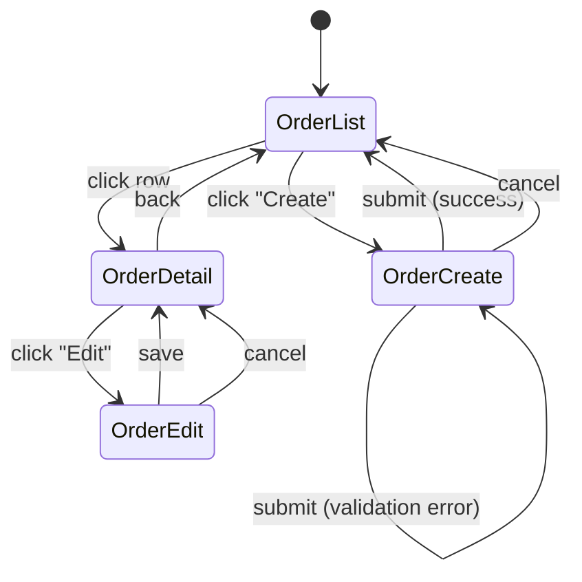
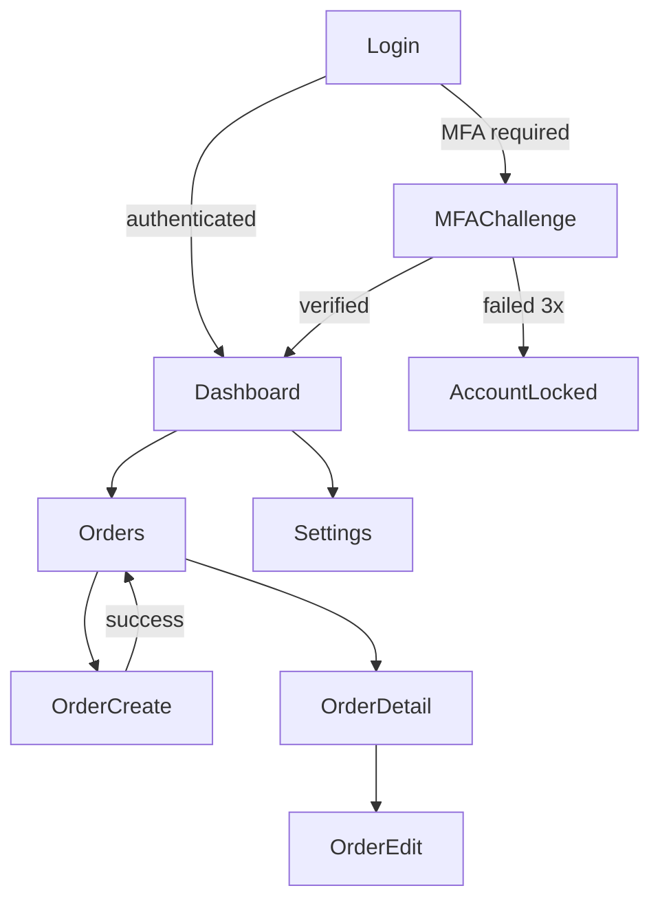
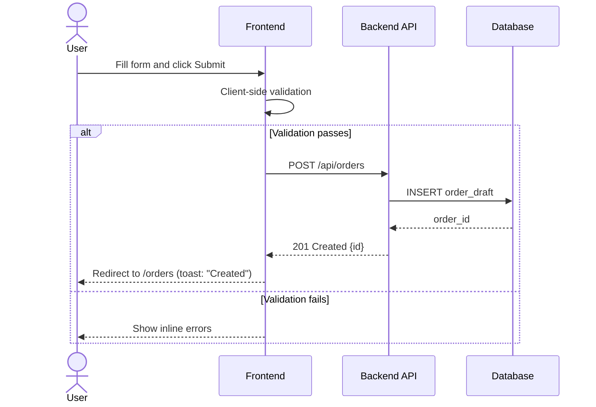

# Design Token Systems and UI Specification Formats for QFAI

> Research guide for storing and managing visual UI definitions across discussion
> packs, specs, and contracts. Compiled 2026-03-15.

---

## Table of Contents

1. [Design Token Systems](#1-design-token-systems)
2. [UI Specification Formats Comparison](#2-ui-specification-formats-comparison)
3. [Screen Transition Documentation](#3-screen-transition-documentation)
4. [Component Specification Schema](#4-component-specification-schema)
5. [HTML+CSS Mock Best Practices](#5-htmlcss-mock-best-practices)
6. [Integration with Development Workflow](#6-integration-with-development-workflow)
7. [Recommendations for QFAI](#7-recommendations-for-qfai)

---

## 1. Design Token Systems

### 1.1 W3C Design Tokens Community Group (DTCG) Specification

The DTCG specification reached its first stable version (2025.10) on October 28, 2025. It provides a vendor-neutral, JSON-based format for exchanging design
decisions across tools and platforms.

**Key properties of the DTCG format:**

- Tokens are JSON objects with `$`-prefixed properties (`$type`, `$value`,
  `$description`, `$extensions`)
- Tokens can be grouped hierarchically via nested JSON objects
- Groups can declare a shared `$type` that child tokens inherit
- Aliases reference other tokens via `{path.to.token}` syntax
- Supports modern color spaces (sRGB, Display P3, etc.)
- Specification is backed by reference implementations in Style Dictionary,
  Tokens Studio, and Terrazzo
- Supported or in progress by 10+ tools: Figma, Sketch, Penpot, Framer,
  Supernova, zeroheight, Knapsack

**DTCG token example:**

```json
{
  "color": {
    "$type": "color",
    "primary": {
      "base": {
        "$value": { "colorSpace": "srgb", "components": [0.2, 0.4, 0.9] },
        "$description": "Primary brand blue"
      },
      "hover": {
        "$value": { "colorSpace": "srgb", "components": [0.15, 0.35, 0.85] }
      }
    }
  }
}
```

### 1.2 Token Taxonomy: Primitive, Semantic, Component

Design tokens follow a three-tier taxonomy:

| Tier          | Also called             | Purpose                                           | Example                                     |
| ------------- | ----------------------- | ------------------------------------------------- | ------------------------------------------- |
| **Primitive** | Global / Core / Raw     | Raw values with no semantic meaning               | `blue-500: #3B82F6`                         |
| **Semantic**  | Alias / Intent / System | Context-bound meaning; references primitives      | `color-action-primary: {blue-500}`          |
| **Component** | Scoped / Local          | Bound to specific components; references semantic | `button-bg-primary: {color-action-primary}` |

**Why this matters for QFAI:** UI contracts currently store visual information
structurally (element IDs, labels, types) but not visually. Adding a
semantic-token layer allows contracts to reference a shared visual language
without embedding raw values.

### 1.3 Token Categories

| Category        | DTCG `$type`                    | Examples                                               |
| --------------- | ------------------------------- | ------------------------------------------------------ |
| **Color**       | `color`                         | Background, text, border, overlay colors               |
| **Typography**  | `typography` (composite)        | Font family, size, weight, line-height, letter-spacing |
| **Spacing**     | `dimension`                     | Padding, margin, gap                                   |
| **Border**      | `border` (composite)            | Width, style, color, radius                            |
| **Shadow**      | `shadow` (composite)            | Box shadows (offset, blur, spread, color)              |
| **Motion**      | `duration`, `cubicBezier`       | Transition durations, easing curves                    |
| **Breakpoints** | `dimension` (via `$extensions`) | Responsive breakpoint widths                           |
| **Opacity**     | `number`                        | Transparency levels                                    |
| **Font family** | `fontFamily`                    | Font stacks                                            |
| **Font weight** | `fontWeight`                    | Numeric weight values                                  |

### 1.4 YAML vs JSON Format Comparison for Tokens

| Criterion           | JSON                                                  | YAML                                              |
| ------------------- | ----------------------------------------------------- | ------------------------------------------------- |
| **DTCG compliance** | Native (spec is JSON)                                 | Requires conversion layer                         |
| **Tooling support** | Universal (Style Dictionary, Terrazzo, Tokens Studio) | Partial (needs yaml-to-json pre-step)             |
| **Readability**     | Verbose with braces/quotes                            | Cleaner for humans; fewer delimiters              |
| **Comments**        | Not supported natively                                | Supported (`#` comments)                          |
| **Version control** | Good diffs                                            | Slightly better diffs (less noise)                |
| **Merge conflicts** | Moderate (brace alignment)                            | Lower (indentation-based)                         |
| **Parse safety**    | Strict; no ambiguity                                  | Gotchas (`no`/`yes` as booleans, `3.10` as float) |

**Recommendation for QFAI:** QFAI already uses YAML for contracts (UI, API).
Design tokens referenced by UI contracts should be authored in YAML for
consistency with the existing QFAI contract ecosystem, with an automated
conversion step to DTCG-compliant JSON for tool consumption. This preserves
human readability and comment support while enabling DTCG tool interoperability.

### 1.5 Platform-Specific Token Transformation

**Style Dictionary (v4, Amazon):**

- Build system that transforms tokens into CSS custom properties, iOS
  (Swift/ObjC), Android (XML/Compose), Sass variables, JS modules, etc.
- First-class DTCG format support in v4
- Extensible via custom transforms, formats, and actions
- CTI taxonomy baked into the transform pipeline

**Terrazzo:**

- Newer DTCG-native tool focused solely on the DTCG spec
- Outputs CSS, Sass, JS/TS, JSON
- Simpler configuration than Style Dictionary
- Good choice for DTCG-first workflows

**Theo (Salesforce, legacy):**

- Original token transformation tool; Salesforce Lightning Design System
- Predates DTCG; uses its own Theo YAML format
- Still works but largely superseded by Style Dictionary

**Transformation pipeline for QFAI:**

```text
QFAI YAML tokens
  -> yaml-to-json (pre-step)
    -> Style Dictionary / Terrazzo
      -> CSS custom properties (Web)
      -> Swift UIColor / Android XML (Mobile)
      -> C#/XAML resources (Windows)
```

### 1.6 Token Naming Conventions (CTI)

The CTI (Category-Type-Item) convention, created by Danny Banks for Style
Dictionary, structures token names hierarchically:

```text
{category}-{type}-{item}-{sub-item}-{state}
```

| Level        | Purpose              | Examples                                  |
| ------------ | -------------------- | ----------------------------------------- |
| **Category** | Output type          | `color`, `size`, `duration`, `font`       |
| **Type**     | Property descriptor  | `background`, `text`, `border`, `padding` |
| **Item**     | Target element/group | `button`, `input`, `card`, `modal`        |
| **Sub-item** | Variant              | `primary`, `secondary`, `destructive`     |
| **State**    | Interaction state    | `default`, `hover`, `focus`, `disabled`   |

**Full example:** `color-background-button-primary-hover`

**Modern evolution:** Many teams now use a flatter semantic approach:

```text
{domain}.{concept}.{property}.{modifier}.{state}
```

Example: `action.primary.background.hover` or `feedback.error.text.default`

**Relevance to QFAI UI contracts:** Token names can serve as the bridge between
UI contract element definitions and actual visual values. For example, a button
element in a UI contract can reference `action.primary.background` instead of a
raw hex value.

---

## 2. UI Specification Formats Comparison

### 2.1 Comparison Matrix

| Format                            | Version-control friendly | Visual fidelity      | Human readable | Machine parseable | Multi-platform     | Effort to maintain |
| --------------------------------- | ------------------------ | -------------------- | -------------- | ----------------- | ------------------ | ------------------ |
| **QFAI YAML contracts (current)** | Excellent                | Low (structure only) | Excellent      | Excellent         | Yes                | Low                |
| **HTML+CSS inline mocks**         | Good                     | High                 | Moderate       | Moderate          | Web-focused        | Moderate           |
| **Mermaid diagrams**              | Excellent                | Low-Med (flows)      | Good           | Good (parseable)  | N/A (abstract)     | Low                |
| **SVG mockups**                   | Poor (binary-like XML)   | High                 | Poor           | Moderate          | Yes (rendered)     | High               |
| **ASCII wireframes**              | Excellent                | Low                  | Good           | Poor              | N/A (abstract)     | Low                |
| **Figma JSON export**             | Poor (huge, noisy)       | Very High            | Poor           | Moderate          | Depends on tooling | Low (auto)         |
| **Storybook specs**               | Good (MDX/JSX)           | High                 | Moderate       | Good              | Framework-specific | Moderate           |

### 2.2 Format-by-Format Analysis

#### HTML+CSS Inline Mocks

**Pros:**

- Directly renderable in any browser; no special tools needed
- Self-contained when using inline styles
- Can be version-controlled as `.html` files within spec directories
- Can reference design tokens via CSS custom properties
- Serve as prototype starting points
- Accessibility attributes (`aria-*`) can be embedded naturally

**Cons:**

- Web-platform-specific (not directly useful for native mobile/Windows)
- Maintaining accuracy as specs evolve requires discipline
- Interactive states need JS or pseudo-class workarounds
- Responsive behavior requires multiple viewport representations

**When to use:** Best for Web-targeted projects where visual fidelity matters and
the mock doubles as a prototype seed. Ideal when QFAI contracts need visual
grounding beyond structural definitions.

#### Mermaid Diagrams

**Pros:**

- Text-based, version-control excellent
- Renders in GitHub, GitLab, VS Code, and most markdown viewers
- QFAI already requires Mermaid in `.qfai/specs/_policies/04_Business-Flow.md`
- Supports flowchart, sequence, state, ER, class, and C4 diagrams
- Low maintenance burden

**Cons:**

- Cannot represent visual design (colors, typography, spacing)
- Layout control is limited (auto-layout)
- Complex diagrams become hard to read
- No interactive states representation

**When to use:** Flows, transitions, entity relationships, and architectural
overviews. Not a substitute for visual UI specification.

#### SVG Mockups

**Pros:**

- Vector format; scales perfectly
- Can be embedded in markdown or HTML
- Can encode precise visual information

**Cons:**

- Large diffs in version control (even small visual changes create big diffs)
- Hard to author by hand; usually exported from tools
- Not semantically parseable for automated verification
- Merge conflicts are essentially unresolvable

**When to use:** Rarely recommended for spec-driven workflows. Better as
supplementary reference images.

#### ASCII Wireframes

**Pros:**

- Zero tooling required; works everywhere
- Perfect version control diffs
- Forces focus on structure over aesthetics

**Cons:**

- No visual fidelity
- Limited expressiveness for complex layouts
- Not machine parseable
- Looks unprofessional in formal specs

**When to use:** Quick structural sketches in discussion packs or OQ resolution.
Not suitable as the primary visual specification.

#### Figma JSON Export

**Pros:**

- Highest visual fidelity (pixel-perfect)
- Can extract design tokens automatically
- Rich component/variant metadata

**Cons:**

- Enormous JSON files (thousands of lines for simple screens)
- Not meaningfully diffable
- Requires Figma-specific tooling to parse
- Vendor lock-in

**When to use:** As a source-of-truth in design-heavy workflows, with
token/contract extraction automated via Figma API. Not for storing directly in
QFAI spec directories.

#### Storybook-like Component Specs

**Pros:**

- Living documentation that stays in sync with code
- Supports interaction testing and visual regression
- Can document variants, states, and responsive behavior
- MDX format is version-control friendly

**Cons:**

- Requires a running component library (not spec-phase)
- Framework-specific (React/Vue/Angular/Svelte)
- Not useful before implementation exists

**When to use:** Post-prototyping as living spec verification. Can complement
QFAI contracts by serving as the "proof" that implementation matches spec.

---

## 3. Screen Transition Documentation

### 3.1 State Machine Approach (XState-Style)

XState models UI as finite state machines with:

- **States**: screens or screen modes
- **Events**: user actions or system events triggering transitions
- **Guards**: conditions that must be true for a transition
- **Actions**: side effects executed during transitions
- **Context**: extended state data (form values, auth status)

**Benefits for QFAI:**

- Formally verifiable (can detect unreachable states, deadlocks)
- Maps directly to implementation (XState machines are executable)
- Captures conditional transitions naturally (guards)
- Serializable as JSON for tool consumption

**Example (conceptual YAML for QFAI):**

```yaml
stateMachine:
  id: order-flow
  initial: order_list
  states:
    order_list:
      on:
        CLICK_CREATE:
          target: order_create
        CLICK_ROW:
          target: order_detail
          guard: hasOrderId
    order_create:
      on:
        SUBMIT:
          target: order_list
          action: showSuccessToast
        CANCEL:
          target: order_list
    order_detail:
      on:
        BACK:
          target: order_list
```

### 3.2 Mermaid stateDiagram for Screen Flows

QFAI already mandates Mermaid in business flow documents. Screen transitions map
naturally to `stateDiagram-v2`:



**Strengths:** Clear, diffable, renders in GitHub/VS Code.
**Limitations:** Cannot express guards, parallel states, or context data.

### 3.3 Mermaid Flowchart for Navigation Maps

For complex multi-section apps, `flowchart` provides more layout control:



**Best for:** Site-wide navigation maps with conditional branches (auth, roles).

### 3.4 Sequence Diagrams for User Interactions

For multi-actor interactions (user, frontend, API, DB):



### 3.5 Capturing Conditional Transitions

| Condition type        | Mermaid representation                    | XState representation       |
| --------------------- | ----------------------------------------- | --------------------------- |
| **Auth state**        | `Login --> \|authenticated\| Dashboard`   | `guard: isAuthenticated`    |
| **Permissions**       | `Dashboard --> \|role=admin\| AdminPanel` | `guard: hasRole('admin')`   |
| **Validation errors** | `alt` block in sequence diagram           | Self-transition with action |
| **Network errors**    | `alt` block or error state node           | `onError` transition        |
| **Feature flags**     | Separate flow branches                    | Guard checking context      |

**Recommendation for QFAI:** Use Mermaid `stateDiagram-v2` in UI contracts or
spec files for screen-level flows. Reserve `sequenceDiagram` for multi-actor
interactions in `.qfai/specs/_policies/04_Business-Flow.md`. Consider adding an optional
`transitions` section to UI contract YAML for machine-parseable flow definitions.

---

## 4. Component Specification Schema

### 4.1 Atomic Design Methodology

Brad Frost's Atomic Design remains the dominant mental model for component
hierarchy in 2025, though most teams adapt it rather than follow it rigidly.

| Level         | Definition                                           | QFAI mapping                                             |
| ------------- | ---------------------------------------------------- | -------------------------------------------------------- |
| **Atoms**     | Basic building blocks (button, input, label, icon)   | UI contract `elements` with `type: button\|input\|label` |
| **Molecules** | Simple groups of atoms (search bar = input + button) | UI contract `elements` with `children`                   |
| **Organisms** | Complex groups (header, data table, form section)    | UI contract `elements` with `type: table\|form`          |
| **Templates** | Page-level layout without real content               | UI contract `screens` with element composition           |
| **Pages**     | Templates filled with real data                      | Runtime prototype instances                              |

**2025 evolution:** Teams now add "ions" (cross-cutting concerns like motion,
accessibility) and "tokens" (design tokens as the sub-atomic layer) to the
model. The metaphor has become a flexible vocabulary rather than a strict
taxonomy.

### 4.2 Component API Documentation

A component spec should document these facets:

```yaml
component:
  id: comp-button
  name: Button
  atomicLevel: atom
  description: Primary interactive element for user actions

  props:
    - name: variant
      type: enum[primary, secondary, destructive, ghost]
      default: primary
      required: false
    - name: size
      type: enum[sm, md, lg]
      default: md
      required: false
    - name: disabled
      type: boolean
      default: false
    - name: loading
      type: boolean
      default: false
    - name: label
      type: string
      required: true

  events:
    - name: click
      payload: { nativeEvent: MouseEvent }
      description: Fired on user click when not disabled/loading
    - name: focus
      payload: null

  slots:
    - name: icon-left
      description: Optional icon before label
    - name: icon-right
      description: Optional icon after label

  tokens:
    background: action.primary.background
    text: action.primary.text
    border-radius: shape.radius.md
    padding: spacing.button.md
```

### 4.3 Variant Documentation

Variants capture the visual/behavioral matrix of a component:

```yaml
variants:
  - dimension: variant
    values:
      - name: primary
        tokens: { bg: action.primary.background, text: action.primary.text }
      - name: secondary
        tokens: { bg: action.secondary.background, text: action.secondary.text }
      - name: destructive
        tokens: { bg: feedback.error.background, text: feedback.error.text }
      - name: ghost
        tokens: { bg: transparent, text: action.primary.text }

  - dimension: size
    values:
      - name: sm
        tokens: { padding: spacing.button.sm, font-size: typography.body.sm }
      - name: md
        tokens: { padding: spacing.button.md, font-size: typography.body.md }
      - name: lg
        tokens: { padding: spacing.button.lg, font-size: typography.body.lg }
```

### 4.4 Responsive Behavior Documentation

```yaml
responsive:
  breakpoints:
    mobile: { max: 639px }
    tablet: { min: 640px, max: 1023px }
    desktop: { min: 1024px }

  rules:
    - element: orders_table
      mobile:
        display: card-list
        columns: [customer, status]
      tablet:
        display: table
        columns: [customer, item, status, date]
      desktop:
        display: table
        columns: [customer, item, status, date, amount, actions]

    - element: nav
      mobile: { pattern: bottom-tab }
      tablet: { pattern: collapsible-sidebar }
      desktop: { pattern: fixed-sidebar }
```

### 4.5 Interaction State Documentation

Every interactive element should define these states:

| State        | Description              | Visual change              | Behavior         |
| ------------ | ------------------------ | -------------------------- | ---------------- |
| **default**  | Normal resting state     | Base token values          | Accepts input    |
| **hover**    | Pointer over element     | Subtle bg/shadow change    | Cursor change    |
| **focus**    | Keyboard focus           | Focus ring / outline       | Tab-navigable    |
| **active**   | Being pressed/clicked    | Pressed appearance         | About to fire    |
| **disabled** | Not available            | Reduced opacity, no cursor | Ignores input    |
| **error**    | Validation failed        | Error color border/text    | Shows message    |
| **loading**  | Async operation pending  | Spinner / skeleton         | Blocks re-submit |
| **selected** | Chosen in a group        | Highlight / check          | Toggle behavior  |
| **readonly** | Visible but not editable | Subtle bg change           | Shows value      |

**QFAI mapping:** The current UI contract `validations` array partially captures
error states. A `states` section per element would make this explicit and
machine-verifiable.

---

## 5. HTML+CSS Mock Best Practices

### 5.1 Self-Contained Inline Styles vs External CSS

| Approach                  | Pros                                        | Cons                                         |
| ------------------------- | ------------------------------------------- | -------------------------------------------- |
| **Inline styles**         | Fully self-contained; works in any viewer   | Verbose; hard to change globally             |
| **`<style>` block**       | Self-contained in one file; DRY via classes | Still one file; good for specs               |
| **External CSS**          | Reusable; maintainable                      | Requires file management; breaks portability |
| **CSS custom properties** | Token-driven; theming-ready                 | Requires property definitions                |

**Recommended for QFAI:** Use a single-file HTML mock with a `<style>` block at
the top that declares CSS custom properties mapped to design tokens, then use
classes for component styles. This balances portability with maintainability.

```html
<!DOCTYPE html>
<html lang="en">
  <head>
    <meta charset="UTF-8" />
    <meta name="viewport" content="width=device-width, initial-scale=1.0" />
    <title>CON-UI-0001: Order Create</title>
    <style>
      /* === Design Token References === */
      :root {
        /* Primitive */
        --blue-500: #3b82f6;
        --gray-100: #f3f4f6;
        --gray-900: #111827;
        --red-500: #ef4444;
        --white: #ffffff;

        /* Semantic */
        --color-action-primary: var(--blue-500);
        --color-background-page: var(--white);
        --color-text-primary: var(--gray-900);
        --color-feedback-error: var(--red-500);
        --spacing-sm: 0.5rem;
        --spacing-md: 1rem;
        --spacing-lg: 1.5rem;
        --radius-md: 0.375rem;
        --font-body: system-ui, -apple-system, sans-serif;
      }

      /* === Component Styles === */
      /* ... classes referencing custom properties ... */
    </style>
  </head>
  <body>
    <!-- Mock content with data-qfai markers -->
  </body>
</html>
```

### 5.2 Design Token Reference in Mocks

Mocks should reference tokens by semantic name, not raw value:

```css
/* DO: semantic reference */
.btn-primary {
  background-color: var(--color-action-primary);
  color: var(--color-text-on-action);
  padding: var(--spacing-sm) var(--spacing-md);
  border-radius: var(--radius-md);
}

/* DON'T: raw values */
.btn-primary {
  background-color: #3b82f6;
  color: white;
  padding: 0.5rem 1rem;
  border-radius: 0.375rem;
}
```

This makes the mock a living reference for which tokens apply to which
components.

### 5.3 Accessibility in Mocks

Mocks should embed accessibility from the start:

```html
<form data-qfai="order-create-form" aria-labelledby="form-title" role="form">
  <h1 id="form-title">Create Order</h1>

  <div role="group" aria-labelledby="customer-label">
    <label id="customer-label" for="customer-id">Customer ID</label>
    <input
      id="customer-id"
      name="customerId"
      type="text"
      required
      aria-required="true"
      aria-describedby="customer-id-error"
      aria-invalid="false"
    />
    <span id="customer-id-error" role="alert" aria-live="polite" hidden>
      Customer ID is required
    </span>
  </div>

  <button type="submit" aria-busy="false">Submit</button>
</form>
```

**Key attributes to always include:**

- `aria-label` / `aria-labelledby` for non-obvious labels
- `aria-required` on required fields
- `aria-invalid` + `aria-describedby` for error states
- `aria-busy` for loading states
- `role` when semantic HTML alone is insufficient
- Proper heading hierarchy (`h1` > `h2` > `h3`)

### 5.4 Interactive State Representation

Since static HTML cannot show hover/focus natively, use these patterns:

#### Pattern 1: CSS state classes with comments

```html
<!-- Default state -->
<button class="btn-primary">Submit</button>

<!-- Hover state (add class to preview) -->
<button class="btn-primary btn-primary--hover">Submit</button>

<!-- Disabled state -->
<button class="btn-primary" disabled aria-disabled="true">Submit</button>

<!-- Loading state -->
<button class="btn-primary btn-primary--loading" aria-busy="true">
  <span class="spinner" aria-hidden="true"></span>
  Submitting...
</button>

<!-- Error state (form context) -->
<input class="input input--error" aria-invalid="true" />
```

#### Pattern 2: State showcase section

Include a "State Gallery" at the bottom of the mock file showing all states of
key components side by side, each clearly labeled.

### 5.5 Responsive Breakpoint Representation

#### Pattern 1: Media query blocks in the `<style>` section

```css
/* Mobile-first base */
.orders-table {
  display: none;
}
.orders-cards {
  display: flex;
  flex-direction: column;
}

/* Tablet (640px+) */
@media (min-width: 640px) {
  .orders-table {
    display: table;
  }
  .orders-cards {
    display: none;
  }
}

/* Desktop (1024px+) */
@media (min-width: 1024px) {
  .orders-table .col-actions {
    display: table-cell;
  }
}
```

#### Pattern 2: Multiple viewport snapshots

Create separate `<section>` blocks in the mock labeled "Mobile (375px)",
"Tablet (768px)", "Desktop (1280px)" showing the layout at each breakpoint.
This is useful for spec review where the mock is viewed as a document.

### 5.6 Making Mocks Directly Usable as Prototyping Starting Points

To ensure mocks translate to prototypes with minimal rework:

1. **Use `data-qfai` attributes** matching contract element IDs:

   ```html
   <table data-qfai="orders-table">
     <input data-qfai="customer-id-input" />
   </table>
   ```

2. **Use semantic HTML elements** (not `<div>` for everything)

3. **Include `name` attributes on form elements** matching API contract fields

4. **Structure CSS with component boundaries** matching atomic design levels

5. **Embed route information** in mock metadata:

   ```html
   <meta name="qfai-route" content="/orders/new" />
   <meta name="qfai-contract" content="CON-UI-0001" />
   ```

6. **Keep JS interactions as comments** describing what should happen:

   ```html
   <!-- ON submit: POST /api/orders -> navigate /orders -> toast "Created" -->
   ```

---

## 6. Integration with Development Workflow

### 6.1 Design Tokens: Spec to Implementation to Verification

```text
Phase 1: Discussion/Spec (QFAI)
  ├── Define semantic token names in UI contracts
  ├── Reference token names in acceptance criteria
  └── Output: tokens.yaml (or tokens section in UI contract)

Phase 2: Implementation (Prototyping/TDD)
  ├── Transform tokens via Style Dictionary -> platform outputs
  ├── Implement components using generated token variables
  └── Output: CSS custom properties, native resources

Phase 3: Verification (ATDD/Verify)
  ├── Visual regression testing (Percy/Chromatic/BackstopJS)
  ├── Token usage audit (custom lint rules)
  ├── Computed style assertions in E2E tests
  └── Output: evidence artifacts (.qfai/evidence/)
```

### 6.2 Contract-Driven UI Development Patterns

QFAI already implements a contract-driven pattern with UI contracts (YAML) as
the specification artifact. The current flow:

```text
UI Contract (YAML)
  -> Spec (01_Spec.md references contract)
    -> Prototype (route + elements exist)
      -> ATDD (acceptance tests verify contract)
        -> Verify (evidence + coverage gate)
```

**Enhancement opportunities:**

| Current state                                | Enhanced state                               |
| -------------------------------------------- | -------------------------------------------- |
| Contract defines structure (elements, types) | Contract also defines visual tokens + states |
| Prototype verified by route reachability     | Prototype also verified by token compliance  |
| ATDD checks behavior only                    | ATDD also checks visual regression baselines |
| Manual UI review by UI/UX Reviewer agent     | Automated token-usage and a11y audit         |

### 6.3 Visual Regression Testing Approaches

| Tool                       | Model              | Strengths                                        | Integration                    |
| -------------------------- | ------------------ | ------------------------------------------------ | ------------------------------ |
| **Percy (BrowserStack)**   | Cloud SaaS         | Cross-browser, AI review agent (2025), CI-native | Playwright, Cypress, Storybook |
| **Chromatic**              | Cloud SaaS         | Storybook-native, component-level, design review | Storybook only                 |
| **BackstopJS**             | Open-source, local | Free, Puppeteer-based, no vendor lock-in         | CI via Docker                  |
| **Playwright screenshots** | Built-in           | Free, E2E-integrated, pixel comparison           | Playwright test runner         |
| **Loki**                   | Open-source        | Storybook + Docker Chrome                        | CI via Docker                  |

**Recommendation for QFAI:** BackstopJS or Playwright built-in screenshots align
best with the open-source, self-contained nature of QFAI. They produce diffable
evidence artifacts that can live in `.qfai/evidence/`.

### 6.4 Bridging the Gap Between Spec and Implementation

| Gap                                                                 | Bridging mechanism                                                 |
| ------------------------------------------------------------------- | ------------------------------------------------------------------ |
| **Structural gap**: spec says "table" but impl uses cards           | UI contract `type` field + runtime marker validation (`data-qfai`) |
| **Visual gap**: spec says "primary blue" but impl uses wrong shade  | Design token contract + computed style assertion                   |
| **Behavioral gap**: spec says "navigates to /orders" but impl stays | ATDD scenario testing action effects                               |
| **State gap**: spec says "shows error" but impl lacks error state   | Interaction state matrix in contract + state-specific test cases   |
| **A11y gap**: spec says "accessible" but impl lacks aria            | A11y contract requirements + axe-core automated audit              |

### 6.5 Detecting Spec Drift

Spec drift occurs when implementation diverges from specification without
updating the spec. QFAI's Drift Protocol already addresses this at the artifact
level. For UI-specific drift:

**Detection mechanisms:**

1. **Contract hash comparison**: Hash the UI contract YAML and store it in
   evidence. If the contract changes, downstream must re-verify.

2. **Runtime marker audit**: `data-qfai` attributes in implementation must match
   contract `selector` patterns. A CI check can verify this.

3. **Visual baseline comparison**: Screenshot baselines tied to contract version.
   Any visual change without contract update triggers a review.

4. **Token usage lint**: Custom lint rule ensures components use only declared
   semantic tokens, not raw values.

5. **Coverage report diff**: `qfai validate` already produces coverage reports.
   Comparing reports across commits surfaces drift.

**QFAI-native drift detection flow:**

```text
git commit triggers CI
  -> qfai validate --fail-on error
    -> Compare contract hashes vs last evidence
      -> If changed: require re-run of affected phase
      -> If implementation changed without contract change: flag for review
    -> Visual regression test against baseline
      -> If visual diff > threshold: require spec review
```

---

## 7. Recommendations for QFAI

### 7.1 Immediate (Low-Effort, High-Value)

1. **Add a `tokens` section to UI contract YAML schema:**

   ```yaml
   # In ui-NNNN-<slug>.yaml
   tokens:
     color-action-primary: "#3B82F6"
     color-background-page: "#FFFFFF"
     spacing-md: "1rem"
     radius-md: "0.375rem"
   ```

   This preserves backward compatibility while enabling visual information
   storage.

2. **Add an `interactions` section per element in UI contracts:**

   ```yaml
   elements:
     - id: submit_button
       label: Submit
       type: button
       required: true
       validations: []
       interactions:
         states: [default, hover, focus, active, disabled, loading]
         defaultState: default
   ```

3. **Standardize Mermaid `stateDiagram-v2` for screen flows** alongside the
   existing `sequenceDiagram` requirement in `.qfai/specs/_policies/04_Business-Flow.md`.

### 7.2 Medium-Term (Moderate Effort)

1. **Introduce HTML+CSS mock files** as optional companions to UI contracts:
   - Store at `.qfai/mocks/ui-NNNN-<slug>.html`
   - Reference from the UI contract YAML: `mock: mocks/ui-0001-orders.html`
   - Single-file, self-contained, using CSS custom properties for tokens
   - Include `data-qfai` markers matching contract element IDs

2. **Add a `responsive` section to UI contracts:**

   ```yaml
   responsive:
     breakpoints:
       mobile: 639
       tablet: 1023
       desktop: 1024
     rules:
       - element: orders_table
         mobile: { display: card-list }
         desktop: { display: table }
   ```

3. **Add optional `transitions` section to UI contracts** for machine-parseable
   screen flow definitions (XState-compatible structure).

### 7.3 Long-Term (Higher Effort, Strategic)

1. **Design token pipeline**: Author tokens in YAML, transform via Style
   Dictionary to platform outputs, validate token usage in implementation.

2. **Visual regression gate**: Add screenshot comparison to `qfai validate` or
   `qfai-verify` using Playwright screenshots + pixel diff.

3. **Component spec schema**: Define a YAML schema for component specifications
   (atomic level, props, events, slots, tokens, variants) that the Contract
   Designer agent can produce.

4. **A11y contract layer**: Add accessibility requirements as first-class
   contract elements (required aria attributes, keyboard navigation patterns,
   color contrast ratios referencing token pairs).

### 7.4 Schema Evolution Path

```text
Current:        UI Contract YAML (structure only)
                  ├── screens[].elements[].{id, label, type, required, validations}
                  └── screens[].actions[].{id, label, kind, effect}

Phase 1:        + tokens{} section
                + elements[].interactions{} section
                + Mermaid stateDiagram in spec/flow docs

Phase 2:        + responsive{} section
                + transitions{} section (XState-compatible)
                + companion HTML mock files
                + elements[].a11y{} section

Phase 3:        + component spec YAML (full atomic design)
                + design token pipeline (YAML -> Style Dictionary -> platforms)
                + visual regression baseline management
                + automated token usage verification
```

---

## Sources

- [W3C DTCG Specification Stable Release (2025.10)](https://www.w3.org/community/design-tokens/2025/10/28/design-tokens-specification-reaches-first-stable-version/)
- [DTCG Format Module 2025.10](https://www.designtokens.org/tr/drafts/format/)
- [Style Dictionary - DTCG Support](https://styledictionary.com/info/dtcg/)
- [Style Dictionary - Transforms](https://styledictionary.com/reference/hooks/transforms/)
- [Naming Tokens in Design Systems - Nathan Curtis / EightShapes](https://medium.com/eightshapes-llc/naming-tokens-in-design-systems-9e86c7444676)
- [How To Name Design Tokens - Smart Interface Design Patterns](https://smart-interface-design-patterns.com/articles/naming-design-tokens/)
- [Naming Best Practices - Smashing Magazine](https://www.smashingmagazine.com/2024/05/naming-best-practices/)
- [Atomic Design Methodology - Brad Frost](https://atomicdesign.bradfrost.com/chapter-2/)
- [Atomic Design in 2025 - DEV Community](https://dev.to/m_midas/atomic-design-and-its-relevance-in-frontend-in-2025-32e9)
- [Atomic Design in 2025: From Rigid Theory to Flexible Practice](https://medium.com/design-bootcamp/atomic-design-in-2025-from-rigid-theory-to-flexible-practice-91f7113b9274)
- [XState Transitions Documentation](https://stately.ai/docs/transitions)
- [Visual Regression Testing Tools Comparison](https://sparkbox.com/foundry/visual_regression_testing_with_backstopjs_applitools_webdriverio_wraith_percy_chromatic)
- [Percy vs Chromatic Comparison](https://medium.com/@crissyjoshua/percy-vs-chromatic-which-visual-regression-testing-tool-to-use-6cdce77238dc)
- [Best Visual Regression Testing Tools for 2026](https://bug0.com/knowledge-base/visual-regression-testing-tools)
- [Spec-Driven Development - InfoQ](https://www.infoq.com/articles/spec-driven-development/)
- [GitHub spec-kit: Spec-Driven Development](https://github.com/github/spec-kit/blob/main/spec-driven.md)
- [What Is Spec-Driven Development - Augment Code](https://www.augmentcode.com/guides/what-is-spec-driven-development)
- [DTCG GitHub Repository](https://github.com/design-tokens/community-group)
- [Terrazzo DTCG Tokens](https://terrazzo.app/docs/guides/dtcg/)
- [Intuit's Flexible Design Token Taxonomy](https://medium.com/@NateBaldwin/creating-a-flexible-design-token-taxonomy-for-intuits-design-system-81c8ff55c59b)
