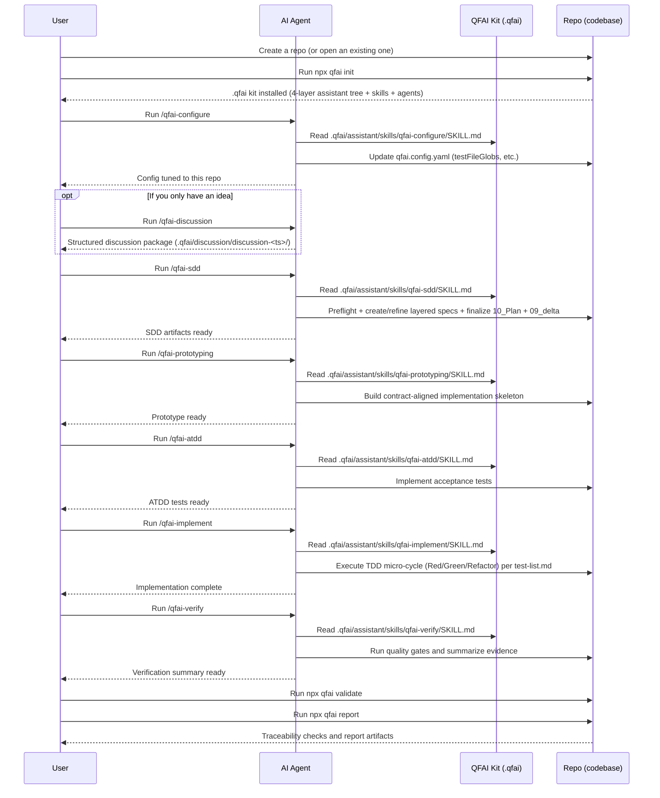
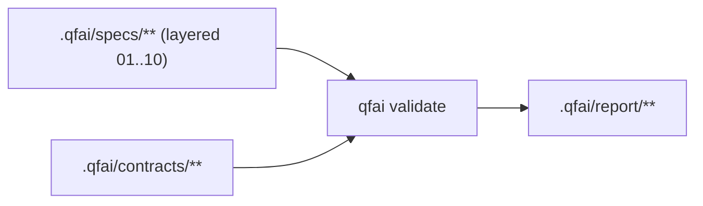

# QFAI (Quality-First AI)

QFAI is a quality-first development kit for AI coding agents.
Its purpose is to improve the quality of AI-generated software outputs by enforcing a structured workflow and validating traceability.

Modern AI coding agents can write code quickly, but they can also misunderstand requirements, drift from intended behavior, or “sound correct” while being wrong.
QFAI addresses these failure modes by standardizing an end-to-end delivery loop and forcing objective checks.

- SDD clarifies what to build, so the agent does not invent requirements while coding.
- ATDD defines acceptance goals as executable scenarios, so correctness is measured rather than assumed.
- TDD enables a self-correcting loop: implement → run tests → fix → repeat.
- Traceability validation enforces that SDD → ATDD → TDD → implementation stays aligned, reducing hallucination-driven drift.
- Result: higher output quality, fewer review cycles, and lower human supervision cost.

QFAI is designed for a skills-driven operating model: engineers select a prepared custom skill and provide only the task intent.
The agent reads the repository, produces the required artifacts, and iterates until the hard gates pass.

## Release status

- Release posture: runtime truthfulness is enforced.
- Prototyping is UI-only and runs a primary-spec evolution loop driven by
  `qfai prototyping iterate --cycle <n>`. Each run resolves exactly one
  primary UI-bearing spec (`prototyping.primarySpecId` in `qfai.config.yaml`,
  a `surface_type: ui-bearing` marker, or `--primary-spec-id`), freezes it at
  cycle 0, and iterates `cycle 0..9` (max 10 cycles) with deterministic stop
  conditions (exit codes 0 continue / 64 convergence / 65 max-iterations /
  66 license-verify failure / 2 input or lock drift). The full set of
  UI-bearing specs is frozen at cycle 0 as `frozenSurfaceUnion` and is read
  only to detect surface drift on later cycles: secondary specs are **not**
  evaluated by that run. Only one primary spec can therefore be evolved per
  project: re-running cycle 0 for a second spec is refused without `--force`,
  and with `--force` it re-seeds `prototyping.json` (`runId`, `specsCovered`,
  `frozenSpecsCovered`) around the new single spec, so the earlier spec's
  iterations do not survive as a valid loop. Iterating a second UI-bearing
  spec has to wait for the per-spec iteration layout.
- Runtime observation is observed-only (no synthetic 200 / API / DB prototyping coverage).
- Per-iter evidence is a single `<screen>.review.json` per declared spec ×
  screen pair (4-axis ordinal verdicts, 6 `*Feel` short-prose impressions
  bounded to 200 words each, `layoutAntiPatternsDetected[]`,
  `designMdViolations[]`, and `pivotDirective`). It is the only
  reviewer-authored file, not the only per-cycle artifact: the CLI itself
  always writes `iterate-plan.json` into the same `iter-NN/` directory, and
  from cycle 1 onward — once the previous cycle is recorded in
  `prototyping.json#iterations[]` — an advisory `iterate-context.json` holding
  the prior scores and open blockers. The opt-in `--capture` and
  `--cycle 0 --emit-skeletons` flags additionally write `<screen>.png` /
  `<screen>.html` there. Archive the whole `iter-NN/` directory; no
  `interaction.json` is written on any path.
- Calibration SSOT is the calibration pack referenced by `calibrationRef.packPath`.

## Installation

qfai is published on npm as **`qfai`**. Install it as a dev dependency:

```bash
npm i -D qfai
# or: pnpm add -D qfai / yarn add -D qfai
```

Let the package manager write the `devDependencies` entry. Do not hand-pin a version
here: `package.json#version` in the published package is the only version source, and a
number copied from prose goes stale on the next release.

> **Do not install from the GitHub repository.** A git specifier such as
> `"qfai": "github:aganesy/QFAI"` maps the dependency key `qfai` to the private monorepo
> root — the manifest `name` is irrelevant, so it lands in `node_modules/qfai` regardless.
> That root ships no `bin` and no built `dist`, so nothing would be runnable or
> importable. Under npm or yarn a `preinstall` guard refuses the install with an
> explanatory error rather than completing silently; under pnpm — or any package manager
> that reports no user agent — it is not caught, so the mistake is yours to avoid. Use the
> npm package, or run it without installing via `npx qfai@latest <command>`.

## Quick start

> **Windows users:** `qfai init` creates symlinks internally.
> You must enable **Developer Mode** (Settings → System → For developers → Developer Mode: ON)
> before running `npx qfai init`, otherwise symlink creation will fail due to insufficient privileges.

```bash
# 1) Initialize QFAI assets in your repository
npx qfai init

# 2) Validate traceability (use this in CI as a hard gate)
npx qfai validate

# 3) Generate a human-readable report (Markdown)
npx qfai report
```

## What you can do (CLI commands)

- `npx qfai --version` (alias `-V`)
  - Prints the installed QFAI version to stdout and exits 0. It works anywhere, including outside a project
    with no `qfai.config.yaml`. The same value is also available as the `version` field of
    `npx qfai doctor --format json`.
- `npx qfai init`
  - Creates the QFAI workspace under `.qfai/` (requirements/specs/contracts/report) and installs the AI assistant kit
    (`assistant/` with the 4-layer tree — `constitution/`, `manifest/`, `catalog/`, `process/` — plus `agents/` and `skills/`), plus `qfai.config.yaml`.
  - Options:

    | Flag                       | Effect                                                                                                                                                                                                                                                                                                                                                                                                                                                                                                                                                                                                                                                                                                                                                                                                                                                                                                                                                                                                                       |
    | -------------------------- | ---------------------------------------------------------------------------------------------------------------------------------------------------------------------------------------------------------------------------------------------------------------------------------------------------------------------------------------------------------------------------------------------------------------------------------------------------------------------------------------------------------------------------------------------------------------------------------------------------------------------------------------------------------------------------------------------------------------------------------------------------------------------------------------------------------------------------------------------------------------------------------------------------------------------------------------------------------------------------------------------------------------------------- |
    | `--dir <path>`             | Output directory (default: the current directory). Wins over `--root` when both are given.                                                                                                                                                                                                                                                                                                                                                                                                                                                                                                                                                                                                                                                                                                                                                                                                                                                                                                                                   |
    | `--root <path>`            | Every other command reads this as the target directory; `init` reads it as the output directory too, but only when `--dir` is omitted.                                                                                                                                                                                                                                                                                                                                                                                                                                                                                                                                                                                                                                                                                                                                                                                                                                                                                       |
    | `--force`                  | Re-generate `.qfai/assistant/{skills,agents}/**` and the published skill/agent wrappers under `.agents/`, `.claude/`, `.codex/` and `.github/`, and prune the legacy wrappers they replace. It also rewrites two kinds of plain (non-wrapper) generated files without asking: the integration READMEs `.agents/README.md`, `.codex/README.md`, `.claude/agents/README.md`, `.github/agents/README.md`, and `.github/copilot-instructions.md` — local edits to those five files are overwritten, so back them up first. `.github/instructions/*.instructions.md` is create-only even under `--force`. The template trees `--force` does not own — `assistant/manifest/**`, `specs/`, `contracts/`, `steering/` and the rest of `.qfai/` — stay create-only. The flag does not narrow what plain `init` always does: the managed `.gitignore` block, the legacy `.qfai/evidence/.gitignore` negations and `git config core.symlinks` are re-applied (and repaired when stale) on every non-dry-run, with or without `--force`. |
    | `--dry-run`                | Report what would change and write nothing. Use it to rehearse `--upgrade-assistant-tree`.                                                                                                                                                                                                                                                                                                                                                                                                                                                                                                                                                                                                                                                                                                                                                                                                                                                                                                                                   |
    | `--upgrade-assistant-tree` | Migrate a pre-recut project to the 4-layer tree. Only the two pre-recut surfaces `.qfai/assistant/instructions/` and `.qfai/assistant/steering/` are scanned; `assistant/manifest/` is already the canonical layer, so it is kept in place and never re-copied. This is what the `D-DEPRECATED-PATH` finding is asking for. Files are copied, never deleted: the legacy paths stay until you remove them, and an existing file at a scanned surface's migration target is kept (reported as `W-USER-EDIT-PRESERVED`) — that warning only ever covers those scanned targets. A project left with nothing but `manifest/` has nothing to migrate and is reported as "no pre-recut surfaces ... found".                                                                                                                                                                                                                                                                                                                         |
    | `--yes`                    | Reserved for a future interactive mode; no behavioural difference today.                                                                                                                                                                                                                                                                                                                                                                                                                                                                                                                                                                                                                                                                                                                                                                                                                                                                                                                                                     |
    | `--verbose`                | Expand the run report's `skipped` list to the full path listing. Off by default, so a no-op re-run prints the skip count and a pointer to this flag instead of every shipped asset path. It does not gate the written or removed listings: those are printed whenever they have entries, with or without this flag.                                                                                                                                                                                                                                                                                                                                                                                                                                                                                                                                                                                                                                                                                                          |
    | `--help`, `-h`             | Print the CLI usage banner and exit without writing anything. Accepted by every command, `init` included, and handled before the command runs.                                                                                                                                                                                                                                                                                                                                                                                                                                                                                                                                                                                                                                                                                                                                                                                                                                                                               |
    | `--version`, `-V`          | Print the installed QFAI version to stdout and exit 0. Accepted by every command, `init` included, and handled before the command runs, so it works outside a project too.                                                                                                                                                                                                                                                                                                                                                                                                                                                                                                                                                                                                                                                                                                                                                                                                                                                   |

- `npx qfai validate`
  - Validates specs/contracts/scenarios/traceability and review artifacts
    (`.qfai/review/review-*/summary.json` + minimum schema), writes `.qfai/report/validate.json`,
    and appends run logs to `.qfai/report/run-*/`; use `--fail-on error` (or `--fail-on warning`) to turn it into a CI gate,
    and `--format github` to emit GitHub-friendly annotations.
    Use `--profile discussion|sdd|prototyping|atdd|tdd|verify` for local skill-owned checks; CI should use default/full validation (or `verify` / `tdd` for the dedicated CI gates).
- `npx qfai report`
  - Produces a human-readable report (`report.md` by default) or an internal JSON export (`report.json`) from `validate.json`; use `--base-url` to link file paths in Markdown to your repository viewer.
- `npx qfai doctor`
  - Diagnoses configuration discovery, path resolution, glob scanning, and `validate.json` inputs before running validate/report; use `--fail-on` to enforce failures in CI.
    Use `--profile prototyping` to add prototyping-specific preflight checks for the
    primary spec, UI contracts, design contract readiness, active agent-wrapper
    integrations, shipped role-input readiness, Playwright CLI launcher
    resolution/probing, and target URL reachability.
    Note: prototyping evidence (`.qfai/evidence/prototyping/prototyping.json`) is produced by the AI workflow
    (`/qfai-prototyping`), not by a general-purpose end-user CLI flow.
    Use `npx qfai prototyping preflight --target-url <url>` for a focused
    prototyping preflight before the skill starts; it surfaces blocking
    `QFAI-DCON-*` design-contract issues alongside runtime assumptions and resolves a runnable Playwright CLI launcher.
    Use `npx qfai prototyping iterate --cycle <n> --target-url <url>` to drive each cycle of the primary-spec
    evolution loop. Exit codes: 0 (continue), 64 (convergence), 65 (max-iterations), 66 (license-verify failure), 2 (input or lock drift).
    Traceability refs inside prototyping evidence must use repo-root-relative concrete artifact refs
    (for example `.qfai/specs/spec-0001/01_Spec.md#L3` or `.qfai/evidence/prototyping/iter-03/home.png`).
    Absolute paths are invalid. The same strict ref grammar is enforced for top-level and leaf evidence-bearing fields, including
    `runtimeGate.evidenceRefs`, `runtimeGate.ui[].declaredRef`, `runtimeGate.ui[].renderEvidenceRefs[]`,
    `runtimeGate.ui[].browserQaEvidenceRefs[]`, `specs[].coverageRefs[].declaredRef`, `specs[].coverageRefs[].observedRefs[]`,
    `fullHarness.iterations[].evidenceRefs.runtimeGate`, `fullHarness.iterations[].evidenceRefs.specCoverage`,
    `fullHarness.iterations[].evidenceRefs.render`, `fullHarness.iterations[].evidenceRefs.browserQa`,
    `fullHarness.iterations[].evidenceRefs.uiObservation`, `fullHarness.iterations[].evidenceRefs.discussion`,
    `fullHarness.iterations[].evidenceRefs.screenContract`, `fullHarness.iterations[].evidenceRefs.trend`,
    `fullHarness.iterations[].l1.axes[].evidenceRefs[]`, `fullHarness.iterations[].l2.axes[].evidenceRefs[]`, and
    `fullHarness.reviewerLogs[].evidenceRefs[]`.
    Semantic rules are also strict: `runtimeGate.ui[].declaredRef` and `fullHarness.iterations[].evidenceRefs.screenContract[]`
    must use the canonical screen contract sourceRef `.qfai/discussion/<pack>/uiux/40_screen_contracts.md#<screenId>`,
    and `specs[].coverageRefs[].declaredRef` must use the canonical spec declaration form
    `.qfai/specs/<specId>/01_Spec.md#L<line>` (for example `.qfai/specs/spec-0001/01_Spec.md#L3`);
    `notes.md`, `appendix.md`, anchor-fragment forms such as `#route-home`, discussion refs, and screen contract refs
    are NOT valid `declaredRef` values.
    `fullHarness` follows a terminal-first state machine: `status="in-progress"` requires `finalDecision="pending"`,
    `reviewerSignoff.status="pending"`, and no `terminationReason`; `status="completed"` requires `terminationReason`,
    a non-pending `finalDecision`, and a terminal `reviewerSignoff`.

## ATDD annotation hard gate

`qfai validate` enforces spec-to-test traceability. `US` and `CON-API` obligations are routed by ID type;
a `TC` obligation is routed by the `Level` its spec declares for it.

- `tests/e2e/**`: annotate all covered user stories with concrete IDs such as `QFAI:SPEC-0001:US-0001`.
- `tests/api/**`: annotate all covered API contracts with concrete IDs such as `QFAI:CON-API-0001`.
- Annotate a covered test case with a concrete ID such as `QFAI:SPEC-0001:TC-0001`, in the directory its declared `Level` names:

  | `Level`                       | Annotated in           |
  | ----------------------------- | ---------------------- |
  | `L1`/`Unit`, `L2`/`Component` | no ATDD annotation     |
  | `L3`/`Integration`            | `tests/integration/**` |
  | `L4`/`API`                    | `tests/api/**`         |
  | `L5`/`E2E`                    | `tests/e2e/**`         |
  | none declared, or unreadable  | `tests/integration/**` |

- Unit and Component test cases carry **no** ATDD annotation obligation. They are gated by the
  per-spec `test-list.md` ledger instead, so do not copy them into `tests/integration/**` to satisfy this gate.
- A `TC` annotation outside the directory its declared `Level` names is rejected. The rule is `Level`-relative,
  not a blanket ban: a `TC` in `tests/api/**` is accepted only for a test case that declares `L4`/`API`, and in
  `tests/e2e/**` only for `L5`/`E2E`.
- `AC` annotations are not required in code; AC coverage is treated as indirect through full `TC` coverage.
- These directories follow `paths.testsDir` from `qfai.config.yaml`; `tests/` above is the default.

## Operating model (skills-driven workflow)

QFAI assumes you operate the project primarily via prepared custom skills.
A custom skill is a reusable task instruction set for your AI coding agent.
The agent reads QFAI assets under `.qfai/assistant/` and produces or updates SDD/ATDD/TDD artifacts and code.

### Where the skills live

- QFAI canonical skills (SSOT): `.qfai/assistant/skills/**` (may be overwritten when you re-run `qfai init --force`).
- QFAI no longer creates local override scaffolds. Project-specific guidance should live in your repository's normal agent docs or be created explicitly by your AI workflow.

### Minimal custom skill set

QFAI includes a small set of custom skills (stored under `.qfai/assistant/skills/`) designed to keep the workflow opinionated and repeatable.

- **qfai-configure**: Analyze the repository (language, frameworks, test layout, directory structure)
  and adjust `qfai.config.yaml` accordingly (especially `testFileGlobs`).
  Run this once right after `npx qfai init`, and re-run it when the repository structure changes.
- **qfai-discussion**: Run a unified structured discussion that produces and maintains the latest discussion pack
  as 15 required markdown files under `.qfai/discussion/discussion-<ts>/`.
  UI-bearing discussion packs may include `prototyping.yaml` as an optional recommendation artifact; non-ui discussion packs typically omit it.
- **qfai-sdd**: Unified SDD entrypoint with discussion-pack preflight guard
  (missing/incomplete/blocking OQ causes stop + next action guidance).
  After preflight, the skill runs a mandatory **Stage 1 Triage** that classifies
  every incoming requirement into one of 8 first-class operations
  (CREATE / UPDATE:APPEND / UPDATE:MODIFY / UPDATE:REMOVE / DELETE / SPLIT /
  MERGE / SUPERSEDE) with an **append-first** bias: existing active specs
  absorb the change unless there is zero subject-token overlap.
  CREATE / DELETE / SPLIT / MERGE / SUPERSEDE / UPDATE:REMOVE require explicit
  `AskUserQuestion` approval, and CREATE rows must register a new `CAP-NNNN`
  in `.qfai/specs/_policies/03_Capabilities.md` before the row is accepted
  (`QFAI-TRIAGE-006`). Every `01_Spec.md` declares a lifecycle
  `Status: active | superseded | deprecated | removed` (`QFAI-STATUS-001..006`).
- **qfai-prototyping**: Primary-spec design evolution loop. Resolves exactly
  one primary UI-bearing spec per invocation and freezes it at cycle 0 (the
  full UI-bearing set is recorded as `frozenSurfaceUnion` for drift detection
  only), then iterates each `spec × screen` pair through up to 10 cycles
  (`cycle 0..9`) of generate → capture → review with a 4-axis ordinal
  rubric, 6 `*Feel` short-prose impressions (200-word bounded), explicit
  layout anti-pattern detection (`lap-001..lap-008`), DESIGN.md token
  violation detection, and explicit pivot permission. Stops
  deterministically when every `spec × screen` pair satisfies the AND
  convergence condition (all four ordinal axes `exceptional` AND
  `layoutAntiPatternsDetected` empty AND `designMdViolations` empty)
  (exit 64), when the 10-cycle budget is exhausted (exit 65), or when a
  stock-photo source violates the cycle-0 frozen license catalog
  (exit 66). Lock drift / input errors exit 2.
- **qfai-atdd**: Implement acceptance tests driven by specs/scenarios.
- **qfai-implement**: Unified TDD micro-cycle (Red/Green/Refactor) one test at a time using `test-list.md` as the execution ledger, including ledger status updates and exception closure.
- **qfai-verify**: Run full-scan local quality gates (`validate --fail-on error`, `report`, repo gates) and produce reviewer-approved evidence under `.qfai/evidence/`.

### Workflow sequence (example)

This sequence shows which skill to run, in what order, and what artifacts to expect.



Operational notes.

- Each custom skill must output in the user’s language (absolute requirement).
- Each custom skill must end with a completion message that enumerates all available next actions and clearly states what to do for each option.
- Except `qfai-discussion`, each skill must analyze the project context (architecture, tech stack, test framework, repo structure) before generating artifacts or code.
- Skills should delegate work to multiple role-based sub-agents (Planner, Architect, Contract Designer, QA, Code Reviewer, etc.) to emulate a real delivery flow.
- Change classification (Primary/Tags) is required in `09_delta.md` and recommended in PRs. See `.qfai/assistant/constitution/change-classification.md`.
- Verification planning is recorded in `09_delta.md` (`Verification -> Plan`) and validated in CI (`VFY-*` rules).
- Review gate policies (required/optional layers, default reviewers, optional
  review modes) are documented in `.qfai/assistant/catalog/review-gate.rules.yml`.
  This catalog is reference material for agents; it is not machine-enforced.
- Review pack structure — `.qfai/review/review-<YYYYMMDDhhmmssSSS>/{review_request.md,R01_*.md,summary.json}` — is the one layout enforced by validation (`QFAI-REVIEW-*`).
- Agent taxonomy and invocation SSOT are defined in `.qfai/assistant/manifest/agent-catalog.yml`, `.qfai/assistant/manifest/agent-routing.yml`, and `.qfai/assistant/manifest/review-profiles.yml`.

## Configuration

Configuration is stored at the repository root as `qfai.config.yaml`; you can change paths, traceability policies, and CI gate thresholds.

Example: override paths and traceability globs.

```yaml
paths:
  contractsDir: .qfai/contracts
  specsDir: .qfai/specs
  discussionDir: .qfai/discussion
  outDir: .qfai/report
  skillsDir: .qfai/assistant/skills
  srcDir: src
  testsDir: tests
validation:
  failOn: error # error | warning | never
  traceability:
    testFileGlobs:
      - "src/**/*.test.ts"
      - "tests/**/*.spec.ts"
    testFileExcludeGlobs:
      - "**/fixtures/**"
    scMustHaveTest: true
```

Notes.

- `validate.json` is a **public** surface: its keys are documented in
  `.qfai/assistant/skills/qfai-verify/references/validate-json-schema.md` and a change to
  them takes the `@api` path (`.qfai/assistant/constitution/change-classification.md`). The
  skills instruct agents to read it, so it is a contract whether or not this file says so —
  it used to say the opposite, which left a consumer following the skills depending on
  something the README disclaimed. `message` text and the order of `issues` are still not
  stable; match on `issues[].code`
- `report.json`, `doctor.json`, and `run-*` JSON logs are internal exports and are not a stable external contract; prefer `report.md` for integrations that must survive tool upgrades.
- Scenario files are expected to use the Gherkin extension `*.feature` (not `*.md`).
- `prototyping.calibration.packPath` points to the calibration pack SSOT; runtime and validator both resolve thresholds and iteration parameters from that pack.
- `prototyping.calibration.thresholds`, `maxIterations`, `plateauDelta`, and `plateauLookback` are unsupported public config fields.
  Put calibration values in the referenced pack instead of `qfai.config.yaml`.
- `validation.traceability.brMustHaveSc`, `scNoTestSeverity`, and `orphanContractsPolicy` were retired: no validator ever read them.
  They are still accepted so an existing config keeps loading, but `qfai validate` reports each one still present as deprecated and inert.
- Observability modules (`src/core/observability/`) exist as foundation code but are **not yet integrated into blocking validation**. They are reserved for future operational instrumentation.

## Specifications and contracts (SDD)

QFAI uses a small, opinionated set of artifacts to reduce ambiguity and prevent agents from “inventing” behavior.

- Requirements: what you want to achieve, constraints, and explicit non-goals.
- Specs: structured expected behaviors, inputs/outputs, edge cases, and invariants.
- Contracts:
  - UI contracts: YAML (`.yaml` / `.yml`)
  - API contracts: YAML (`.yaml` / `.yml`)
  - DB contracts: SQL (`.sql`)
- Scenarios (ATDD): Gherkin `.feature` files

Traceability is validated across these artifacts, so code changes remain grounded in the specs and the tests prove compliance.

## SSOT boundaries



- Specs SSOT: `.qfai/specs/**` (layered files `01_Spec.md`..`09_delta.md` + shared delta layer)
- Contracts SSOT: `.qfai/contracts/**`
- Report outputs (`.qfai/report/**`) are derived artifacts and not SSOT.

## Minimal tutorial

1. `npx qfai init`
2. Run `/qfai-discussion` to structure scope, open questions, and produce a discussion pack under `.qfai/discussion/discussion-<ts>/`.
3. Run `/qfai-sdd` to build layered specs and finalized plans.
4. For each completed review cycle, append artifacts under `.qfai/review/review-<timestamp>/`.
5. Run `npx qfai validate` then `npx qfai report`.

Release gate behavior:

- Merge gate: `qfai validate` must pass (`error=0`), and open OQ is warning.
- Release gate: set `release_candidate: true` in the Initiative layer (`03_Initiative.md`); open OQ then becomes error.

## FAQ

- Q: I referenced AC/TC directly from upper layers and got an error.
  - A: Keep upper-to-lower references out of upper docs; use `16_Traceability-ledger.md` for cross-layer linkage.
- Q: Ledger validation fails with missing columns.
  - A: Ensure required columns exist: `trace_id,obj_id,init_id,cap_id,flow_id,us_id,ac_id,ex_ids,tc_ids`.
- Q: `09_delta.md` fails validation.
  - A: Include all required sections (`Change Summary`, `Rationale`, `Candidates Considered`, `Adopted`, `Rejected`, `Impact`, `Follow-ups`) and include both `DO NOT` and `Temptation` in `Rejected`.
- Q: release_candidate validation fails due open questions.
  - A: Keep specs definition-only, use `.qfai/report/run-*` as execution logs, and convert open OQ to `resolved` or `deferred` with evidence.
- Q: `qfai validate` reports `QFAI-STATUS-001` ("Status bullet が見つかりません") on every spec.
  - A: Each `01_Spec.md` must declare `- Status: active | superseded | deprecated | removed` (introduced in 1.8.8).
    Add `Status: active` for currently-authoritative specs; superseded specs need a `- Superseded-by: spec-NNNN` companion bullet,
    and deprecated/removed specs need `- Deprecated-at: YYYY-MM-DD`. The previous `QFAI-STATUS-001` (status-leak guard) was renamed to `QFAI-STATUSLEAK-001` to free the namespace.
- Q: `/qfai-sdd` is asking for `AskUserQuestion` approval that earlier versions never asked for.
  - A: Stage 1 Triage classifies each requirement into one of 8 first-class operations and gates approval-required ops
    (CREATE / DELETE / SPLIT / MERGE / SUPERSEDE / UPDATE:REMOVE) on explicit user confirmation. Append-first means UPDATE:APPEND on an existing active spec is the default;
    CREATE additionally requires a new `CAP-NNNN` row in `.qfai/specs/_policies/03_Capabilities.md` before the row is accepted (`QFAI-TRIAGE-006`).
- Q: `delta.md` validation reports `QFAI-TRIAGE-001` ("Change Summary はあるが Triage がありません") as a warning.
  - A: 1.8.8 introduced a `## Triage` section requirement. Existing operational deltas without it currently fail soft (warning); future minor versions will promote this to an error after operational backfill.

## Continuous integration

QFAI generates integration wrappers under `.agents/**`, `.claude/**`,
`.github/**`, and `.codex/**`.

`npx qfai init` also installs two GitHub Actions workflows,
`.github/workflows/qfai-validate.yml` and `.github/workflows/qfai-tests.yml`.
It writes exactly those two files into that directory and touches nothing else
there, and both open with a ``# Generated by `qfai init` `` line. Both trigger on
every push to `main` or `master` and on every pull request, and both run on the
runner `vars.QFAI_CI_RUNNER` names (`ubuntu-latest` when you set nothing).

- `qfai-validate.yml` runs `npx qfai validate --profile full --fail-on error`.
  It installs dependencies from whichever lockfile the repository has (pnpm /
  yarn / npm) and falls back to `npm install` when there is none, and it takes
  the Node version from your `.nvmrc` or `.node-version`, warning and
  continuing on Node 20 when you have neither. The pnpm route is the one
  precondition it stops closed on: the pnpm setup action resolves the pnpm
  version from `package.json#packageManager` and from nowhere else, so a tree
  holding a `pnpm-lock.yaml` with no such field fails the job with an
  annotation naming the field rather than reporting a validation it never ran.
  Declare `"packageManager": "pnpm@X.Y.Z"` so CI matches the version you
  develop against. The `full` profile includes the `QFAI-TEST-001` test-todo
  stub gate, so the job can fail your default branch on findings your existing
  CI never checked.
- `qfai-tests.yml` declares one lane per test layer (unit, component,
  integration, api, e2e) and runs none of them until you opt in: a lane runs
  only when your `package.json` declares the matching `test:<layer>` script
  **and** a name-only diff against the base commit selected that lane. On a
  repository that declares no such script it executes nothing.

Both files are copied create-only — `qfai init` never overwrites an existing
copy, not even with `--force` — so edit them freely. Deleting one is a choice
`qfai init` remembers rather than undoes: it records what it installed in
`.qfai/install-provenance.json` (keep that file committed), and never recreates
a workflow you removed.

On any other CI platform, configure the job yourself and run:

```bash
pnpm ci:gate
pnpm check-types:future
# or, minimum gate only:
npx qfai validate --fail-on error
```

Recommended baseline.

- Keep CI on default/full validation (`qfai validate --fail-on error` or `qfai validate --profile verify --fail-on error`); do not use partial profiles in CI.
- Keep `pnpm check-types:future` as a separate mandatory gate so future TS compatibility runs once without duplicating `pnpm ci:gate`.
- Add a report step (`npx qfai report`) when you need a human-readable artifact.
- Tune traceability globs in `qfai.config.yaml` to match your test layout.

Waiver policy.

- A waiver's `rule:` is the finding's `code`, copied verbatim from
  `.qfai/report/validate.json` — `QFAI-ATDD-112`, `TDDLIST_UNKNOWN_LEVEL`,
  `E_TC_ORPHAN`. Do not strip the `QFAI-` prefix; the stripped form
  (`ATDD-112`) is kept working only for waiver files written against older
  releases.
- Use waivers only for `warning` / `info` findings (false positives).
- Waivers that target `error` findings are invalid and fail validation (`QFAI-WAIVER-002`).
- Expired waivers are reported as warnings (`QFAI-WAIVER-003`) and must be renewed or removed with evidence.
- Suppressed findings remain visible in reports as `suppressed=true`; waivers do not erase findings.

Typical customizations.

- Add a `doctor` step before validate if you want to fail fast on path/glob/config issues.
- Publish `.qfai/report/validate.json`, `report.md`, and relevant `.qfai/report/run-*/` logs as CI artifacts.

## Generated structure

`npx qfai init` generates the following structure in your repository.

```text
.
├── .agents
│   ├── README.md
│   └── skills
│       └── qfai-configure
│           └── SKILL.md
├── .github
│   └── workflows
│       ├── qfai-tests.yml
│       └── qfai-validate.yml
├── .qfai
│   ├── assistant
│   │   ├── agents
│   │   │   ├── acceptance-test-engineer.md
│   │   │   ├── architecture-reviewer.md
│   │   │   ├── backend-engineer.md
│   │   │   ├── completion-reviewer.md
│   │   │   ├── delivery-planner.md
│   │   │   ├── devops-ci-engineer.md
│   │   │   ├── discovery-analyst.md
│   │   │   ├── doc-steward.md
│   │   │   ├── frontend-engineer.md
│   │   │   ├── implementation-reviewer.md
│   │   │   ├── orchestrator.md
│   │   │   ├── product-experience-architect.md
│   │   │   ├── product-surface-reviewer.md
│   │   │   ├── qa-gatekeeper.md
│   │   │   ├── qa-strategist.md
│   │   │   ├── requirements-analyst.md
│   │   │   ├── requirements-reviewer.md
│   │   │   ├── solution-architect.md
│   │   │   └── test-design-analyst.md
│   │   ├── constitution
│   │   │   ├── agent-selection.md
│   │   │   ├── change-classification.md
│   │   │   ├── communication.md
│   │   │   ├── constitution.md
│   │   │   ├── drift-protocol.md
│   │   │   ├── quality.md
│   │   │   ├── requirements-decomposition.md
│   │   │   ├── research-first-protocol.md
│   │   │   ├── shared-skill-delegation-baseline.md
│   │   │   ├── shared-skill-operating-baseline.md
│   │   │   ├── thinking.md
│   │   │   └── workflow.md
│   │   ├── manifest
│   │   │   ├── agent-catalog.yml
│   │   │   ├── agent-routing.yml
│   │   │   └── review-profiles.yml
│   │   ├── process
│   │   │   └── migrations
│   │   │       └── v<X.Y.Z>-<topic>.md
│   │   ├── skills
│   │   │   ├── qfai-configure
│   │   │   │   └── SKILL.md
│   │   │   ├── qfai-discussion
│   │   │   │   ├── references
│   │   │   │   │   └── rcp_footer.md
│   │   │   │   └── SKILL.md
│   │   │   ├── qfai-prototyping
│   │   │   │   └── SKILL.md
│   │   │   ├── qfai-sdd
│   │   │   │   ├── references
│   │   │   │   │   └── rcp_footer.md
│   │   │   │   └── SKILL.md
│   │   │   ├── qfai-atdd
│   │   │   │   └── SKILL.md
│   │   │   ├── qfai-implement
│   │   │   │   └── SKILL.md
│   │   │   └── qfai-verify
│   │   │       └── SKILL.md
│   │   └── catalog
│   │       ├── cli-ux-guidelines.md
│   │       ├── manifest.md
│   │       ├── product.md
│   │       ├── review-gate.rules.yml
│   │       ├── spec_required_files.json
│   │       ├── structure.md
│   │       ├── tech.md
│   │       ├── test-layers-ci-lanes.md
│   │       ├── test-layers.md
│   │       ├── ui-definition-protocol.md
│   │       └── worklog-entry.schema.md
│   └── waivers.yml
└── qfai.config.yaml
```

`qfai init` does not seed `.qfai` workflow artifacts such as specs, discussions,
contracts, evidence, reports, reviews, placeholder spec directories, or artifact
README files. Those files are created later by QFAI skills when real work exists.

### AI work-log surface (`.qfai/steering/`)

`qfai init` also creates `.qfai/steering/`, the per-project work-log surface for
AI coding agents, with a `README.md` and an `entry.md` template under `_templates/`. Each entry is a
markdown file with YAML frontmatter, and `npx qfai validate` polices the surface in
the `sdd` and full profiles via `W-WORKLOG-SCHEMA`, `W-WORKLOG-BROKEN-LINK`,
`W-WORKLOG-STALE`, `W-PENDING-PROMOTION` and `R-HANDOFF-INCOMPLETE`.

The frontmatter contract and the **per-kind write trigger** — which `kind` an
agent writes when — are in the seeded
`.qfai/assistant/catalog/worklog-entry.schema.md`.

Note that `.qfai/steering/` (the work-log surface) is a different directory from
the legacy `.qfai/assistant/steering/` (the pre-recut assistant path).

Integration wrappers are also generated for immediate use:

- Agents/Codex VS Code: `.agents/skills/**`
- Claude Code: `.claude/skills/**`, `.claude/agents/**`
- GitHub Copilot: `.github/skills/**`, `.github/agents/**`
- Codex: `.codex/skills/**`, `.codex/agents/**`

## Agent integrations

`npx qfai init` installs canonical skills under `.qfai/assistant/skills/**` (SSOT)
and generates thin wrapper assets for Agents/Codex VS Code / Copilot / Claude Code / Codex.
Canonical agent markdown under `.qfai/assistant/agents/**` uses a shared YAML frontmatter
subset (`name`, `description`, `tools`) compatible with Claude Code and GitHub Copilot,
while Codex consumes `.codex/agents/*.toml` profiles generated from that same markdown.
The `.claude` / `.github` agent wrappers are symlinks and follow the canonical document
automatically; the Codex profiles are generated files, so rerun `npx qfai init --force`
to refresh them (and any other wrapper asset that has drifted).
`--force` deletes as well as overwrites: it removes the command and prompt wrappers earlier releases
installed under `.claude/commands/` and `.github/prompts/`, and the skill wrappers it installed under
`.claude/skills/`, `.agents/skills/`, `.codex/skills/` and `.github/skills/` for skills QFAI no longer
ships — the directory wrappers releases before the symlink recut copied there as well as the symlinks
that replaced them. Files it did not write — a project's own slash command, prompt file or skill,
including one published from a project-authored `.qfai/assistant/skills/` entry — are left in place,
whatever they are named. Ownership is read from the file, not the name: a wrapper is removed only when
it carries the delegation line to the canonical document of the same name, or is a symlink into
`.qfai/assistant/skills/`. One consequence of that: a symlink has no content to prove who wrote it, so
if you publish a canonical skill of your own under a name QFAI itself once shipped, `--force` removes
that link. Your `.qfai/assistant/skills/` entry is untouched; re-create the link to publish it again.

## Contributing (for QFAI maintainers)

This repository is a monorepo, and the distributable package is under `packages/qfai`.
The repository root `README.md` and `packages/qfai/README.md` are kept aligned by
`scripts/check-readme-alignment.mjs`, which CI runs as part of `pnpm ci:lint`: every line
outside a `readme-align:ignore-start` / `readme-align:ignore-end` HTML-comment block must be
identical in both files. When you change documentation, apply the edit to both READMEs, or
wrap the intentionally file-specific part in those markers.

## License

MIT
