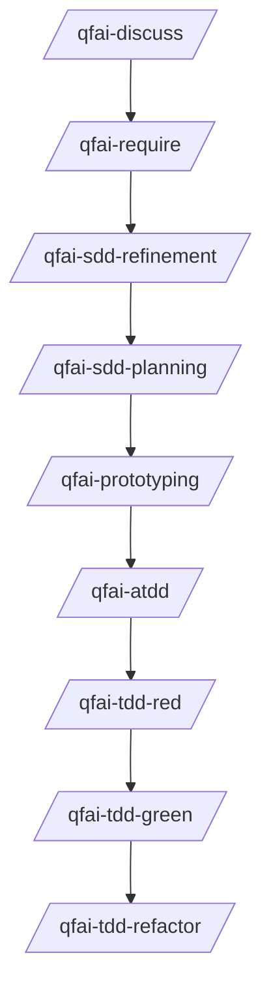

# .qfai (QFAI Workspace)

## Purpose

`.qfai/` is the single workspace for QFAI artifacts so requirements, contracts, spec packs, and automation stay aligned.

This folder is generated by `qfai init` and designed to be:

- predictable (stable layout),
- reviewable (human-readable Markdown/YAML/SQL),
- machine-checkable (validators enforce minimal structural rules).

## Recommended QFAI sequence (project)



> Formatting must follow the templates and checklists documented in each directory README.

## Directory map

```text
.qfai/
├── README.md
├── discussions/
│   ├── README.md
│   └── discuss-0001-<topic>.md
├── assistant/
│   ├── skills/               # canonical skills (SSOT)
│   ├── skills.local/         # project-specific overrides
│   ├── agents/               # sub-agent missions
│   ├── steering/             # project steering inputs
│   └── instructions/         # workflow and guardrail docs
├── require/
│   ├── README.md
│   ├── glossary.md
│   ├── actors.md
│   ├── business-flows.md
│   ├── require.md
│   └── open-questions.md
├── contracts/
│   ├── README.md
│   ├── api/
│   │   ├── README.md
│   │   └── api-0001-sample.yaml
│   ├── db/
│   │   ├── README.md
│   │   └── db-0001-sample.sql
│   └── ui/
│       ├── README.md
│       └── ui-0001-sample.yaml
├── specs/
│   ├── README.md
│   └── spec-001/
│       ├── 01_Spec.md
│       ├── 02_Objective.md
│       ├── 03_Initiative.md
│       ├── 04_Capability.md
│       ├── 05_Business-flow.feature
│       ├── 06_User-stories.md
│       ├── 07_Acceptance-criteria.md
│       ├── 08_Business-rules.md
│       ├── 09_Examples.feature
│       ├── 10_Test-cases.md
│       ├── 11_Contracts.md
│       ├── 12_Glossary.md
│       ├── 13_Constraints.md
│       ├── 14_Decisions.md
│       ├── 15_Open-questions.md
│       ├── 16_Traceability-ledger.md
│       ├── 17_Plan.md
│       └── 18_delta.md
├── templates/
│   └── spec/                 # compatibility templates (legacy path)
└── evidence/
    ├── README.md
    └── <skill>-<run>.md
```

## Rules (global)

### R1. README-as-SSOT for formatting

Each directory `README.md` defines:

- required files,
- template expectations,
- quality checklist,
- anti-patterns.

Custom skills should read relevant README files before writing artifacts.

### R2. Evidence is not versioned by default

Evidence under `.qfai/evidence/` is gitignored by default.
It is useful for local review but should not pollute version control.

### R3. Keep artifacts atomic

- Prefer small stable identifiers (REQ/BR/AC/TC/EX/etc.) over long mixed paragraphs.
- If one line contains multiple independent constraints, split it.

### R4. Templates live with owning skills

Canonical SDD templates are stored under:

- `.qfai/assistant/skills/qfai-sdd-refinement/templates/spec-pack/`
- `.qfai/assistant/skills/qfai-sdd-planning/templates/spec-pack/`

`specs/README.md` points to the exact template files.

## Skills (SSOT)

`assistant/skills/**` is the canonical source.
Tool-specific wrappers (`.claude/skills`, `.github/skills`, `.codex/skills`) should point to this tree.

## Where to look next

- Requirements format: `require/README.md`
- Contracts format: `contracts/README.md` and child READMEs
- Spec pack format: `specs/README.md`
- Change classification: `assistant/instructions/change-classification.md`
- Evidence rules: `evidence/README.md`
