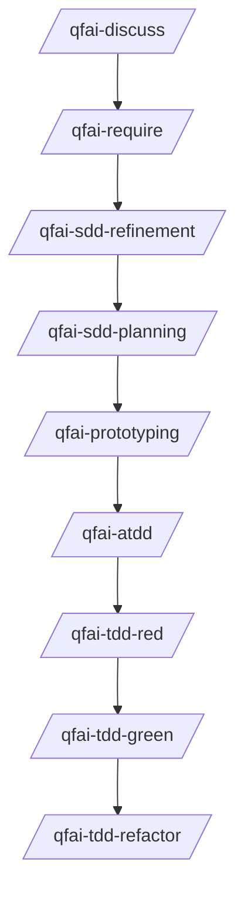

# .qfai (QFAI Workspace)

## Purpose

`.qfai/` is the single workspace for QFAI artifacts so requirements, contracts, spec packs, and automation stay aligned.

This folder is generated by `qfai init` and designed to be:

- predictable (stable layout),
- reviewable (human-readable Markdown/YAML/SQL),
- machine-checkable (validators enforce minimal structural rules).

## Recommended QFAI sequence (project)



> Formatting must follow the templates and checklists documented in each directory README.

## Directory map

```text
.qfai/
├── README.md
├── discuss/
│   └── README.md
├── assistant/
│   ├── skills/               # canonical skills (SSOT)
│   ├── skills.local/         # project-specific overrides
│   ├── agents/               # sub-agent missions
│   ├── steering/             # project steering inputs
│   └── instructions/         # workflow and guardrail docs
├── require/
│   ├── README.md
│   └── require-YYYYMMDDhhmmssSSS/
│       ├── 01_sources.md
│       ├── 02_requirement-index.md
│       └── 03_open-questions.md
├── report/
│   └── README.md
├── review/
│   └── README.md
├── status/
│   ├── README.md
│   └── .gitignore
├── contracts/
│   ├── README.md
│   ├── api/
│   │   └── README.md
│   ├── db/
│   │   └── README.md
│   └── ui/
│       └── README.md
├── specs/
│   └── README.md
└── evidence/
    ├── README.md
    ├── .gitignore
    └── <skill>-<run>.md
```

## Rules (global)

### R1. README-as-SSOT for formatting

Each directory `README.md` defines:

- required files,
- template expectations,
- quality checklist,
- anti-patterns.

Custom skills should read relevant README files before writing artifacts.

### R2. Evidence is not versioned by default

Evidence under `.qfai/evidence/` is gitignored by default.
It is useful for local review but should not pollute version control.

### R3. Keep artifacts atomic

- Prefer small stable identifiers (REQ/BR/AC/TC/EX/etc.) over long mixed paragraphs.
- If one line contains multiple independent constraints, split it.

### R4. Spec Pack 01..18 is runtime SSOT

- Runtime validators and downstream skills consume `01_*` to `18_*`.
- Traceability links are written in `16_Traceability-ledger.md`.
- Derived outputs under `.qfai/report/**` are non-SSOT.

### R5. init is an empty scaffold

- `qfai init` creates README-centric directories for `discuss`, `require`, `report`, `status`, `contracts`, and `specs`.
- Sample artifacts are provided under skill templates (for example, `assistant/skills/qfai-sdd/templates/contracts/`).

## Skills (SSOT)

`assistant/skills/**` is the canonical source.
Invoke canonical skills from this tree directly.

## Where to look next

- Requirements format: `require/README.md`
- Review gate format: `review/README.md`
- Contracts format: `contracts/README.md` and child READMEs
- Spec pack format: `specs/README.md`
- Change classification: `assistant/instructions/change-classification.md`
- Evidence rules: `evidence/README.md`
