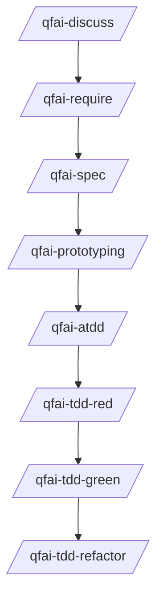

# .qfai (QFAI Workspace)

## Purpose

`.qfai/` is the **single workspace** for QFAI artifacts so that requirements, contracts, spec packs, and automation stay aligned and traceable.

This folder is generated by `qfai init`. It is designed to be:

- **predictable** (stable file layout),
- **reviewable** (human-readable Markdown/YAML/SQL),
- **machine-checkable** (validators enforce minimal structural rules).

## Recommended QFAI sequence (project)



> Formatting MUST follow the templates in each directory README.
> Do not invent per-file formats.
> Requirements decomposition starts from **Actors** and **Business Flows** in `require/`.
> Keep `business-flows.md` as the top-level narrative backbone; derive REQ/SPEC/SCENARIO from BF steps.

## Directory map

```text
.qfai/
├── README.md
├── discussions/
│   ├── README.md
│   └── discuss-0001-<topic>.md   # discussion log (decision/evidence)
├── assistant/
│   ├── prompts/            # canonical prompts (SSOT)
│   ├── prompts.local/      # minimal overrides (project-specific)
│   ├── skills/             # skill wrappers (experimental)
│   ├── skills.local/       # project-specific skill overrides
│   ├── agents/             # sub-agent missions / guardrails
│   ├── steering/           # project steering (inputs for prompts)
│   └── instructions/       # tool/integration instructions
├── require/
│   ├── README.md
│   ├── glossary.md         # terms (SSOT)
│   ├── actors.md           # actor catalog (SSOT)
│   ├── business-flows.md   # business flow catalog (SSOT)
│   ├── require.md          # requirements (REQ-*) + BF coverage map
│   └── open-questions.md
├── contracts/
│   ├── README.md
│   ├── api/README.md       # OpenAPI YAML style guide
│   ├── db/README.md        # SQL contracts style guide
│   └── ui/README.md        # UI contract YAML style guide
├── specs/
│   ├── README.md
│   └── spec-0001/
│       ├── spec.md
│       ├── delta.md
│       ├── scenario.feature
│       ├── case-catalogue.md
│       └── traceability-matrix.md
└── evidence/
    ├── README.md
    └── <prompt>-<run>.md   # completion evidence (gitignored by default)
```

## Rules (global)

### R1. README-as-SSOT for formatting

Each directory `README.md` defines:

- required files,
- canonical **template**,
- realistic **sample**,
- quality checklist,
- anti-patterns.

All custom prompts must:

1. read the relevant directory README(s),
2. generate artifacts matching their templates,
3. run a self-check before declaring completion.

### R2. Evidence is not versioned by default

Evidence under `.qfai/evidence/` is **gitignored by default** (see repository `.gitignore` and/or project `.git/info/exclude`).

- Evidence is still useful locally and in PR review (attach or paste snippets), but it should not pollute version control.

### R3. Keep artifacts atomic

- Prefer many small, stable identifiers (REQ/BR/AC/CASE/SC) over long paragraphs that hide multiple rules.
- If a statement contains multiple independent “must” clauses, split it.

### R4. Do not put templates in prompts

Templates/samples MUST live only in `.qfai/**/README.md`.
Prompts only **reference** them to avoid double maintenance.

## Skills (experimental)

QFAI also ships an **assistant skills** tree at `assistant/skills/`.

Currently, these `SKILL.md` files are **thin wrappers** around the canonical prompts (SSOT remains `assistant/prompts/`).

Later versions will migrate SSOT from prompts to skills and update tool wrappers accordingly.

## Where to look next

- Requirements format: `require/README.md`
- Contracts format: `contracts/README.md` and sub-READMEs
- Spec pack format: `specs/README.md`
- Change classification (Primary/Tags): `assistant/instructions/change-classification.md`
- Evidence rules: `evidence/README.md`
