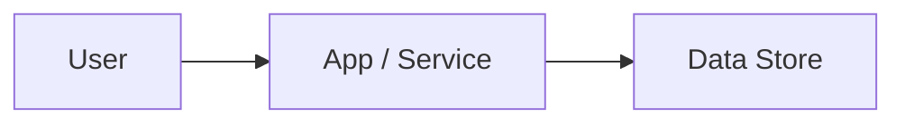

# 01 Context

<!-- UX-INTENT: If UI-bearing, record brand intent and product context here and in 04_Sources.md -->

## UI-bearing Classification

Classification determines whether UI/UX sidecar artifacts are required.

- ui_bearing: [true|false]
- primary_surface: [web|mobile|desktop|cli|mixed|non-ui]
- secondary_surfaces:
  - [optional]
- classification_rationale: [Why this classification was chosen]

Notes:

- `primary_surface` is a classification field. Valid values: `web|mobile|desktop|cli|mixed|non-ui`.
- `non-ui` is only valid when `ui_bearing: false`. It is a classification value, not a prototyping surface.
- `cli` is a UI-bearing surface. When classified as `cli`, set `ui_bearing: true`. `cli` is not a visual-prototyping surface, so a **cli-only** pack — `primary_surface: cli` with no `web`/`mobile`/`desktop`/`mixed` entry in `secondary_surfaces` — gets no root `DESIGN.md` (see `references/ui-bearing-playbook.md#visual-prototyping-surfaces-vs-cli`). A visual `secondary_surfaces` entry still requires one.
- Prototyping **execution** surfaces (used in `prototyping.yaml`) are a strict subset: `web|mobile|desktop|mixed`.
- `cli` and `non-ui` are classification-only values and never appear in `prototyping.yaml`. `/qfai-prototyping` rejects them, so a cli-only pack emits none.

## Design Direction

Required when a classified surface is `web`, `mobile`, `desktop` or `mixed`. Omit for cli-only and non-ui.

The user chooses this; `references/design-dna-intake.md` says how to put the choice to them. `/qfai-sdd`'s `common-design-md` step authors root `DESIGN.md` from it, and asks nothing further.

- adopted_theme: [the published theme or design system this product is built on]
- brand_accent: [what departs from it — typically the primary hue and the typeface pairing]
- conventions_kept: [what stays ordinary on purpose]
- chosen_by: [user|assumption]

Notes:

- `chosen_by: assumption` records a direction taken without the user, which is what `--auto` does. It is a labelled assumption, not a decision, and belongs in `11_OQ-Register.md` until someone confirms it.
- Name a theme, not an adjective. "Calm and modern" is not something `/qfai-sdd` can resolve tokens from.

## Metadata

| Key           | Value                        |
| ------------- | ---------------------------- |
| Discussion ID | discussion-YYYYMMDDhhmmssSSS |
| Date          | YYYY-MM-DD                   |
| Owner         | <role/person>                |
| Source        | <request/context>            |

## Goal and Completion Criteria

- Goal:
- Measurable completion criteria:

## Stakeholders

- Primary stakeholders:
- Secondary stakeholders:

## Background

- Business context:
- Technical context:
- Historical context:

## Inputs

- Existing repository facts:
- External references:
- Assumptions:

## Key Issues

- Issue 1:
- Issue 2:

## Inception Deck

### Why Are We Here?

- Purpose:

### Elevator Pitch

- For: <target users>
- Who: <need/problem>
- The: <product name>
- Is a: <category>
- That: <key benefit>
- Unlike: <alternatives>
- Our product: <differentiator>

### Product Box

- Headline feature 1:
- Headline feature 2:
- Headline feature 3:

### Meet Your Neighbors

- Upstream dependencies:
- Downstream dependencies:
- External integrations:

### Show the Solution

- High-level architecture:
- Key components:

<!-- UX-INTENT: If UI-bearing, reference 04_Sources.md and uiux/40_screen_contracts.md for design direction alignment -->

### What Keeps Us Up at Night

| Risk | Probability | Impact | Mitigation |
| ---- | ----------- | ------ | ---------- |
| R1   | medium      | high   | TBD        |

### Size It Up

- Estimated effort:
- Target timeline:

### What's Going to Give

| Dimension | Priority | Notes |
| --------- | -------- | ----- |
| Scope     | 1        |       |
| Quality   | 2        |       |
| Time      | 3        |       |
| Budget    | 4        |       |

### What's It Going to Take

- Required skills:
- Team composition:
- Infrastructure:
