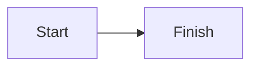

# BF-0001: Example flow

## Purpose

`<Who carries out this flow, and the outcome it reaches.>`

## Flow

## Alternate and exception paths

- `<branch, failure, interruption or resumption, and where it leads>`
