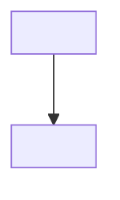

# Technology

## Stack

| Component           | Choice                                     |
| ------------------- | ------------------------------------------ |
| Runtime             | `<language runtime and supported version>` |
| Platform            | `<supported operating systems>`            |
| CI                  | `<CI service>`                             |
| Language            | `<language and version>`                   |
| Package manager     | `<package manager and version>`            |
| Build tool          | `<build tool>`                             |
| Test runner         | `<test runner>`                            |
| Lint / format       | `<linter and formatter>`                   |
| CSS framework       | `<CSS framework, or none>`                 |
| Component catalogue | `<primary component catalogue, or none>`   |

## Architecture

| Layer         | Responsibility                      | Depends on    |
| ------------- | ----------------------------------- | ------------- |
| <upper layer> | <what the layer is responsible for> | <lower layer> |
| <lower layer> | <what the layer is responsible for> | -             |

## Dependencies

- `<package>`
  - `<what the project uses it for>`

## Standard commands (copy-paste)

- Install: `<install command>`
- Format: `<format check command>`
- Test: `<test command>`
- Lint: `<lint command>`
- Typecheck: `<typecheck command>`
- Build: `<build command>`
- Skeleton: `<smallest command that proves the application entrypoint starts>`
- Validate: `<qfai validate command>`
- Pack / distribution: `<package or artifact check command, or remove this line>`
