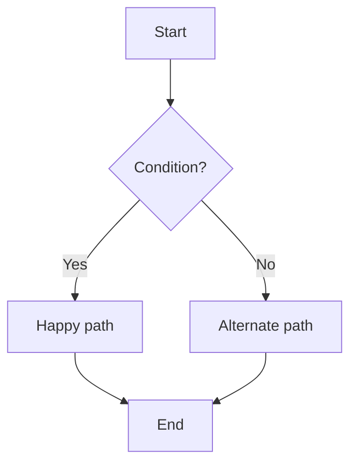

# Business Flow Candidates

## Purpose

- Business goal:
- Success outcome:

## Actors / Systems

- Actor:
- System:

## Preconditions

- Preconditions for this flow:

## Flow Overview

Use Mermaid fences only.



## Alternate / Exception Flows

- Branch A:
- Exception B:

## Notes

- If sequence-level details are needed, add a separate ` ```mermaid ` block with `sequenceDiagram`.
- Do not write Mermaid syntax in ` ```text ` or language-less fences.
- Gherkin belongs to `spec-XXXX/04_Examples.feature`, not Business Flow.
