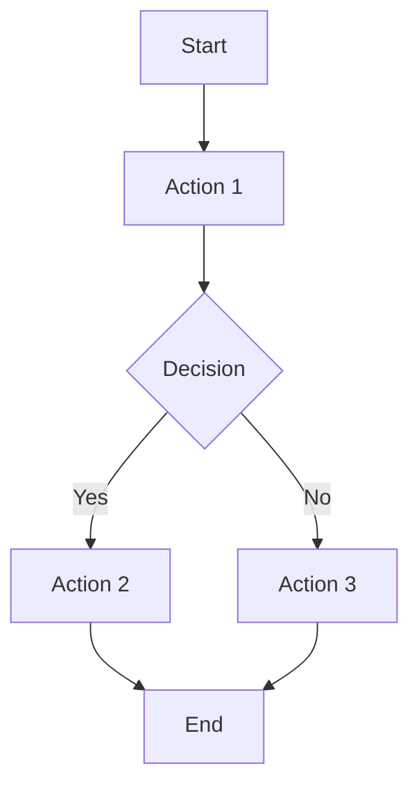

# 03 Story Workshop

## User Stories

### US-001: <Story Title>

- As a: <role>
- I want: <action>
- So that: <benefit>

#### Acceptance Criteria

- AC-001-01:
- AC-001-02:

#### Example Seeds

| Perspective          | Example                  | Status |
| -------------------- | ------------------------ | ------ |
| Happy path           | <example>                | seed   |
| Negative path        | <example>                | seed   |
| Edge / boundary      | <example>                | seed   |
| Permission / role    | <example>                | seed   |
| State transition     | <example or N/A>         | seed   |
| Idempotency / retry  | <example or N/A>         | seed   |

## User Flows

## Flow Descriptions

- Flow 1:
  - Entry point:
  - Steps:
  - Exit point:
