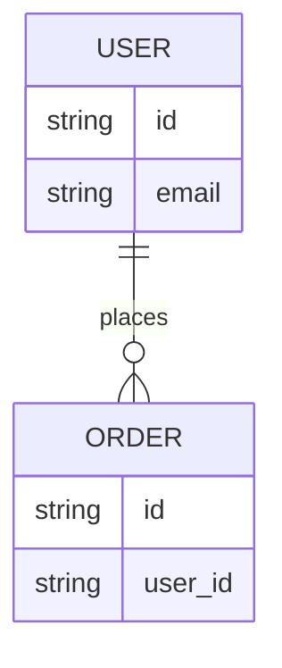

# 05 Contracts

## Purpose

- Describe API/UI/DB contract boundaries in shared language.
- Model relationships with Mermaid when expressing entities or ownership.

## Diagram (Mermaid required for ER/relationship)

## Notes

- Keep detailed SSOT in `.qfai/contracts/**`.
- Use this file as the shared contract index and relationship map.
