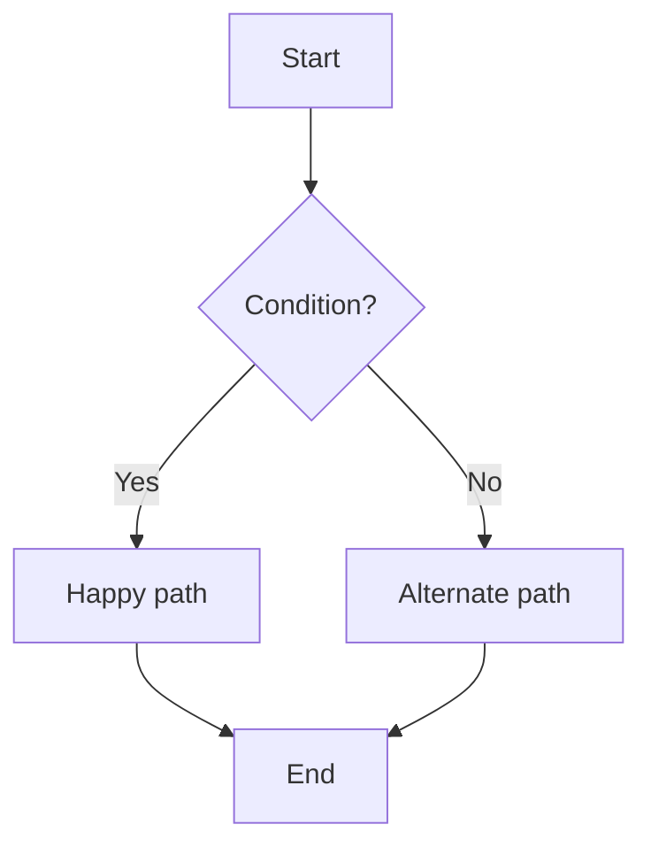

# 04 Business Flow

## Purpose

- Describe the high-level business process as upstream input for user stories and examples.

## Actors / Systems

- Actor:
- System:

## Preconditions

- Preconditions:

## Flow Overview



## Alternate / Exception Flows

- ALT-01:
- EX-01:

## Notes

- If required, add another ` ```mermaid ` block with `sequenceDiagram`.
- Do not use ` ```text ` or language-less fences for Mermaid diagrams.
- Keep Gherkin scenarios in `spec-XXXX/05_Examples.feature`.
