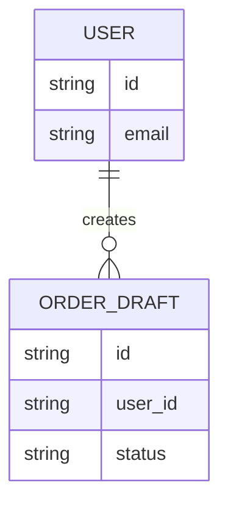

# 05 Contracts

## Purpose

- Keep contracts as SSOT under `.qfai/contracts/**` with deterministic IDs.
- Use this file as a readable index with short IDs for planning and review.

## Contract Index

### DB Contracts

| Short ID | Entity | Declared ID | File | Purpose |
| -------- | ------ | ----------- | ---- | ------- |
| DB-001 | order_drafts | CON-DB-0001 | `.qfai/contracts/db/db-0001-<slug>.sql` | draft persistence |

### API Contracts

| Short ID | Router | Declared ID | File | Purpose |
| -------- | ------ | ----------- | ---- | ------- |
| API-001 | /api/orders | CON-API-0001 | `.qfai/contracts/api/api-0001-<slug>.yaml` | create draft |

### UI Contracts

| Short ID | Screen | Declared ID | File | Purpose |
| -------- | ------ | ----------- | ---- | ------- |
| UI-001 | order-create | CON-UI-0001 | `.qfai/contracts/ui/ui-0001-<slug>.yaml` | draft input form |

## Mapping Rules

- `DB-001` maps to `CON-DB-0001`, file `db-0001-<slug>.sql`.
- `API-001` maps to `CON-API-0001`, file `api-0001-<slug>.yaml`.
- `UI-001` maps to `CON-UI-0001`, file `ui-0001-<slug>.yaml`.
- `<slug>` must be kebab-case from entity/router/screen.
- If no contracts are needed, keep each table and state `0 items` explicitly.

## Diagram (Mermaid required for ER/relationship)

