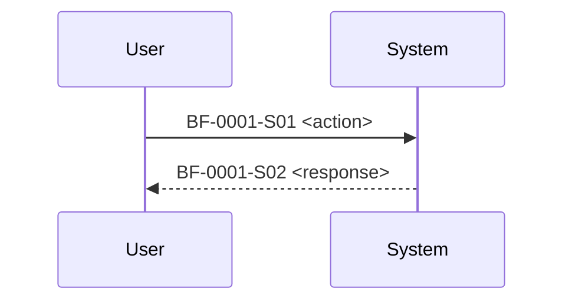

# discussions

## Purpose

`discussions/` stores **decision-quality conversation logs** that lead to requirements and specs.

Use it to capture:

- assumptions, constraints, trade-offs
- candidate options and why rejected
- links to evidence (`.qfai/evidence/`) if any
- open questions that must be resolved later

This directory is designed for **reviewable diffs**: prefer structured Markdown over free-form chat dumps.

## File naming

```text
discuss-0001-<topic>.md
discuss-0002-<topic>.md
...
```

## Template (discuss-\*.md)

```md
# Discuss: <topic>

## Metadata

| Key     | Value                                     |
| ------- | ----------------------------------------- |
| Date    | <YYYY-MM-DD>                              |
| Owner   | <role/person>                             |
| Related | require/require.md, specs/spec-\*/spec.md |

## Context

- Why are we discussing this?

## Actors (draft)

- [ACT-0001] <name>: <intent>

## Business Flows (draft)

- Drafts MUST still use Mermaid `sequenceDiagram` format.



## Glossary seeds (draft)

- [TERM-0001] <term>: <definition>

## Options considered

### Option A

- Pros:
- Cons:
- Decision:

### Option B

...

## Decision

- What we decided and why.

## Open Questions

- [OQ-0001] ...
```

## Rules

- Keep IDs stable once referenced elsewhere.
- If the discussion changes requirements/specs, record the linkage (IDs and file paths).
