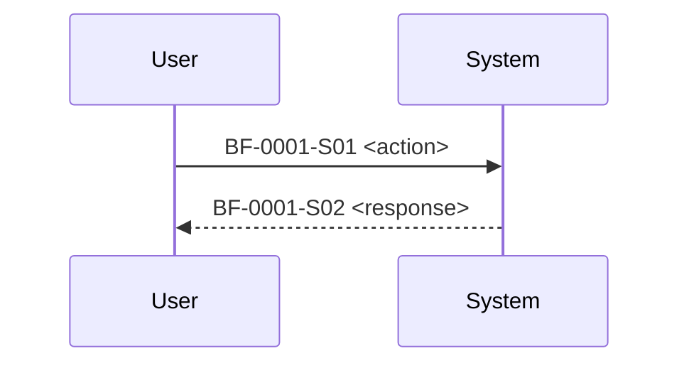

# Business Flows

## Rules

- Business flows MUST be documented as Mermaid `sequenceDiagram`.
- One flow per diagram is recommended. Split large flows.
- Embed BF step IDs in each message line for traceability.
- Legacy bullet `Steps:` format is not allowed.

## Flows

### BF-0001: <name>

- Goal: <one verifiable outcome>
- Primary actor: [ACT-0001]
- Supporting actors: <optional>
- Trigger: <what starts the flow>
- Preconditions: <optional>
- Success criteria:
  - <observable outcome>

### Variations / Exceptions

- V1: <when> -> <difference>
