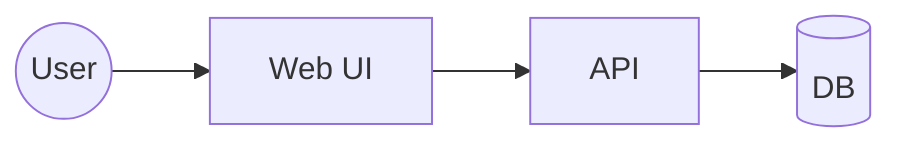

# Plan: <Feature name>

Spec ID: <spec-XXXX>  
Plan ID: <PLAN-YYYY>  
Status: Draft | Ready | Approved  
Created: <YYYY-MM-DD>  
Updated: <YYYY-MM-DD>  
Owner (AI/Role): <...>  
Reviewer (AI/Role): <...>

---

## 1. Metadata

- Repository: <org/repo>
- Target version: <vX.Y.Z>
- Related docs:
  - spec.md: `<path>`
  - scenario.feature: `<path>`
  - case-catalogue.md: `<path>`
  - contracts: `<path(s)>`
- SSOT references (MUST read):
  - `.qfai/assistant/steering/test-layers.md`
  - `.qfai/assistant/instructions/drift-protocol.md`

---

## 2. Context & Scope

### 2.1 Context

- Problem statement:
- Background:
- Why now:

### 2.2 In scope

- ...

### 2.3 Out of scope

- ...

### 2.4 Constraints

- Product/Business constraints:
- Tech constraints:
- Ops/Compliance constraints:
- Timeline constraints:

---

## 3. Goals / Non-goals

### 3.1 Goals (must achieve)

- ...

### 3.2 Non-goals (explicitly not doing)

- ...

---

## 4. Architecture Outline

> Keep this section as architecture anchors for downstream phases.  
> Avoid implementation details that belong to code-level design docs.

### 4.1 System context diagram (Mermaid)

### 4.2 Module boundaries

- Module A: responsibility, public API, data ownership
- Module B: responsibility, public API, data ownership

### 4.3 Data model / migrations

- Entities:
  - ...
- Constraints / invariants:
  - ...
- Migration plan (if any):
  - ...

### 4.4 API / Interfaces (contracts)

- Endpoints / messages:
  - ...
- Error contract:
  - ...
- Auth / RBAC:
  - ...

### 4.5 Cross-cutting concerns

- Logging/Tracing:
- Metrics:
- Config:
- i18n:
- Security:
- Performance:

---

## 5. Verification Strategy

> MUST: define by test layers (L1-L5), not by ATDD/TDD execution order.  
> MUST: floors/ratios are signals, not completion gates.

### 5.1 Test Layers & Responsibilities

#### L1 Unit

- Purpose:
- What to test:
- What NOT to test:
- Examples:

#### L2 Component

- Purpose:
- What to test:
- What NOT to test:
- Examples:

#### L3 Integration

- Purpose:
- What to test:
- What NOT to test:
- Examples:

#### L4 API

- Purpose:
- What to test:
- What NOT to test:
- Examples:

#### L5 E2E

- Purpose:
- What to test:
- What NOT to test:
- Examples:

### 5.2 Traceability Mapping

| Item   | Source (SC/CASE/BR/AC/Contract) | Layer   | Notes   |
| ------ | ------------------------------- | ------- | ------- |
| <item> | <source>                        | <layer> | <notes> |

### 5.3 Acceptance Test Implementation Rules

- DO NOT:
  - map SC to Unit mechanically
  - convert every SC into E2E
  - inflate tests only to satisfy floors/ratios
- MUST:
  - keep Coverage Ledger at 100% (or approved exception)
  - keep layer tags and allocation consistent

### 5.4 Test Data & Environment

- Data seeding strategy:
- Isolation/reset strategy:
- External dependencies:

### 5.5 Quality Gates (CI/Suite)

- Local:
- PR:
- Merge:
- Nightly:

### 5.6 Volume Signals (NOT gates)

- Signals to watch:
  - E2E floor:
  - API floor:
  - Integration floor (K=...):
- If signal unmet:
  - STOP -> Change Request (3 options + recommendation) -> user approval
  - rerun owner phase (planning/refinement) if upstream updates are needed

---

## 6. Implementation Plan

### 6.1 Steps (independently testable increments)

1. Step 1:
   - Output:
   - Tests (layers):
2. Step 2:
   - Output:
   - Tests (layers):

### 6.2 Dependencies / sequencing constraints

- ...

### 6.3 Rollout / Migration

- ...

### 6.4 Observability updates

- ...

---

## 7. Risks & Mitigations

| Risk | Impact | Mitigation | Owner |
| ---- | ------ | ---------- | ----- |
| ...  | ...    | ...        | ...   |

---

## 8. Open Questions / Blockers

> Planning should finish with blockers resolved by default.  
> If blockers remain, record approved exceptions in delta decisions.

### 8.1 Blockers

- (B1) <question>

**Decision package (3 options + recommendation)**

- Option A (minimal change):
- Option B (recommended):
- Option C (alternative):
- Recommendation:
- Decision needed from user:

### 8.2 Non-blockers

- ...

---

## 9. Done Checklist

- [ ] Required sections are filled (no TBD/TODO/TBA/???)
- [ ] Allocation / traceability mapping is completed
- [ ] Coverage Ledger rule is stated (100% or approved exception)
- [ ] Floors/ratios are treated as signals (not gates)
- [ ] CI suite strategy is written
- [ ] Blockers are resolved (or approved exceptions are recorded)
- [ ] Reviewer is assigned and reviewer gate criteria are acknowledged
